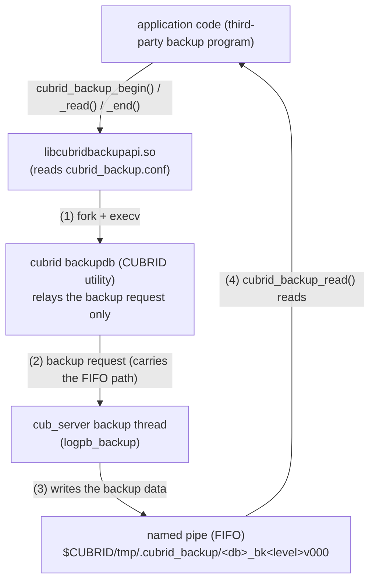
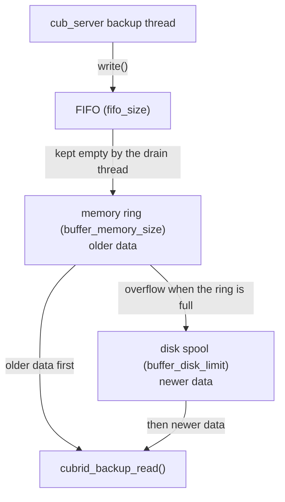
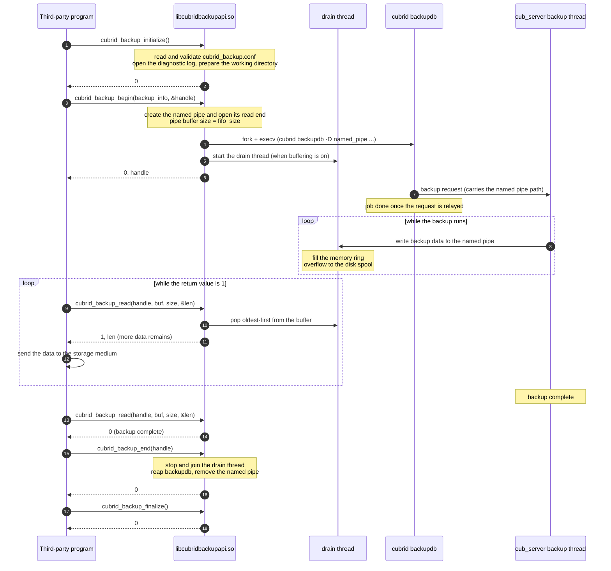
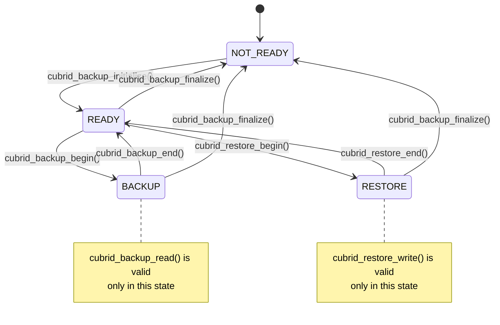

# cubrid-backup-api

**Languages:** English (this document) · [한국어](README.md)

A C library that lets a third-party backup solution drive CUBRID database backup and restore directly from its own application code.

---

## Table of contents

1. [Introduction](#1-introduction)
2. [Architecture and data flow](#2-architecture-and-data-flow)
3. [Configuration (cubrid_backup.conf)](#3-configuration-cubrid_backupconf)
4. [Data structures](#4-data-structures)
5. [API functions](#5-api-functions)
6. [API call-flow diagrams](#6-api-call-flow-diagrams)
7. [Sample code and build guide](#7-sample-code-and-build-guide)
8. [Repository layout and test guide](#8-repository-layout-and-test-guide)
9. [Logging and troubleshooting](#9-logging-and-troubleshooting)
10. [Limitations](#10-limitations)

---

## 1. Introduction

### 1.1 What this library does

`cubrid-backup-api` allows a backup solution to exchange a CUBRID backup image **through memory buffers instead of through files**.

CUBRID's standard backup tool, `cubrid backupdb`, writes the backup image to a file on disk. For a backup solution that needs to move that image to tape or object storage, this means two steps — first create a backup file on local disk, then read it back and transmit it — and it requires temporary disk space as large as the backup image itself.

This library removes the intermediate step. The application calls `cubrid_backup_read()` repeatedly, receives the backup data in its own buffer, and streams it straight to whatever storage medium it uses. Restore works in the opposite direction: the application hands the stored backup data back to the API through `cubrid_restore_write()`.

### 1.2 Delivered files

A build produces one header file and one shared library.

| File | Description |
|---|---|
| `cubrid_backup_api.h` | Public header. Contains all structures, enumerations, and function prototypes. |
| `libcubridbackupapi.so` | Shared library. The actual file is `libcubridbackupapi.so.<major>.<minor>`; this name is a symbolic link to it. |

### 1.3 Prerequisites

| Item | Requirement |
|---|---|
| Operating system | Linux (POSIX). Windows is not supported. |
| CUBRID | CUBRID must be installed on the **same host** as the database being backed up. |
| Environment variable | `CUBRID` must point to the CUBRID installation directory. |
| Execution rights | The process must run as a user that can execute `cubrid` commands, because the library runs the `cubrid backupdb` utility internally. |
| Linking | Link against `libcubridbackupapi.so` and `pthread`. |

**Required directory permissions**

| Path | Permission | Why it is needed |
|---|---|---|
| `$CUBRID` | read · write · execute | `cubrid_backup_initialize()` verifies that this path is a usable directory. |
| `$CUBRID/log` | write | The API opens its **own diagnostic log file**, `cubrid_backup.log`, in append mode. If it cannot be opened, `cubrid_backup_initialize()` fails. This is a log belonging to this library and has nothing to do with the database transaction log (WAL). |
| Temporary working directory | read · write · execute | The API creates a `.cubrid_backup` directory here and, inside it, the named pipe that carries the backup data. See [9.3 Temporary working directory](#93-temporary-working-directory) for how the location is chosen. |

---

## 2. Architecture and data flow

### 2.1 The overall picture

Backup data flows out of the CUBRID server (`cub_server`), through a named pipe, and into the application. The components involved play distinctly different roles, so it helps to separate them first.



The roles are as follows.

| Component | Role |
|---|---|
| `libcubridbackupapi.so` | Creates the named pipe, launches `cubrid backupdb`, and reads the backup data out of the named pipe for the application. |
| `cubrid backupdb` | Asks `cub_server` to back up to the given named pipe path. **Relaying that request is where the utility's job ends** — it neither produces nor writes the backup data. |
| `cub_server` backup thread | Receives the request, performs the actual backup, and writes the resulting backup data to the named pipe (`logpb_backup`). |
| named pipe (FIFO) | The channel the server writes and the API reads. No backup image is ever written to a disk file because the backup destination *is* this named pipe. |

> **Note** Steps (1)–(4) show the path taken by the request and the data. The order in which the application must call the API functions is described in [2.2](#22-how-backup-works).

Restore runs in the opposite direction. The application hands its stored backup data to the API, which reassembles it into a **backup volume file**. Restoring the database itself from that file is done with the CUBRID command `cubrid restoredb`.

### 2.2 How backup works

```
 1. cubrid_backup_initialize()
      Read and validate cubrid_backup.conf
      Open the API diagnostic log file ($CUBRID/log/cubrid_backup.log)
      Prepare the temporary working directory

 2. cubrid_backup_begin()
      Create the named pipe ──► $CUBRID/tmp/.cubrid_backup/<db>_bk<level>v000
      Open its read end and size the pipe buffer (fifo_size)
      Launch cubrid backupdb (fork + execv)
      If configured, allocate the memory ring and disk spool, then start the drain thread

 3. cubrid backupdb ──► cub_server
      Requests a backup, passing the named pipe path created in step 2.
      Once the request is relayed, the utility's job is done.

 4. cub_server backup thread (logpb_backup)
      Performs the backup and writes the backup data to the named pipe.
      The drain thread reads that named pipe continuously into the tiered buffer.

 5. cubrid_backup_read()
      Pops oldest-first from the buffer into the caller's buffer.
      return value 1: more data remains → call again
      return value 0: backup complete

 6. cubrid_backup_end()
      Stop and join the drain thread, reap the cubrid backupdb process, remove the named pipe

 7. cubrid_backup_finalize()
      Clean up the temporary working directory, close the API diagnostic log file
```

The **drain thread** is a dedicated thread the API creates internally in order to read the named pipe continuously. It performs no part of the backup in parallel; its only job is to keep the pipe empty so that the server never blocks on its write. [2.3](#23-why-the-tiered-buffer-exists) explains why that matters.

The byte stream the application receives in step 5 is **identical to the backup volume file that `cubrid backupdb` would have produced**. If the application writes that stream to a file, the file matches byte for byte.

> **Note** The flow above describes an online backup (`sa_mode` = 0). In an offline (stand-alone) backup there is no database server process, so the `cubrid backupdb` utility performs the backup itself and writes to the named pipe.

### 2.3 Why the tiered buffer exists

If the named pipe were read only when `cubrid_backup_read()` is called, a slow consumer — a tape device, a network upload — would let the pipe fill up. Once the pipe is full, **the `cub_server` backup thread blocks on its write.**

The **log portion** of a backup (archive log plus active log) is copied while the server holds the global log critical section (`LOG_CS`). A write that blocks during that phase therefore extends how long the critical section is held, which can turn into commit latency for the entire database.

To mitigate this, the API keeps a tiered buffer of its own. The drain thread keeps the pipe empty, so the server's backup thread proceeds without waiting and the consumer's slowness is absorbed inside the API instead.



*Memory is drained before disk, so byte order is always preserved.*

Three operating modes follow from the configuration.

| Mode | Configuration | Behaviour |
|---|---|---|
| No buffering | `buffer_memory_size=0` (default) | No drain thread is created; the named pipe is read only when `cubrid_backup_read()` is called. |
| Memory only | `buffer_memory_size>0`, `buffer_disk_limit=0` | The drain thread keeps the pipe empty by filling the memory ring. When the ring is full it waits for the consumer to catch up. |
| Memory plus disk | `buffer_memory_size>0`, `buffer_disk_limit>0` | Overflow from the memory ring goes to the disk spool. This gives the largest buffer capacity, and enables a policy that reserves the disk tier for the log portion of the backup. |

> **Note** Buffering settings affect only backup throughput and the impact on the server. The backup image produced is byte-for-byte identical in every mode.
>
> **Note** The tiered buffer applies to the backup path only; the restore path is not buffered.

### 2.4 How restore works

Restore means handing backup data back to the API so that it can **reassemble the backup volume file**.

```
 1. cubrid_backup_initialize()

 2. cubrid_restore_begin()
      Create the target file ──► <backup_file_path>/<db_name>_bk<backup_level>v000

 3. cubrid_restore_write()
      Appends the supplied data to the file in order.
      The data must be supplied in the same order it was read during backup.

 4. cubrid_restore_end()
      Close the file

 5. cubrid_backup_finalize()

 6. (CUBRID command) cubrid restoredb -B <directory> -l <level> <db_name>
      Restore the database itself from the reassembled backup volume.
```

Step 6 belongs to the CUBRID utility, not to the API. The current version does not support applying backup data directly to a database (`RESTORE_TO_DB`).

---

## 3. Configuration (cubrid_backup.conf)

### 3.1 File location and syntax

The configuration file path is fixed at **`$CUBRID/conf/cubrid_backup.conf`**. The file is optional: if it does not exist, every setting takes its default value.

```ini
[backup]
compress=true
thread_count=8

fifo_size=1MB
buffer_memory_size=64MB
buffer_disk_limit=256MB
buffer_disk_path=/var/tmp/cubrid_backup_spool
buffer_disk_keep_spool=false

[restore]
partial_recovery=false
```

> **Caution** To use the example as-is, create the directory named by `buffer_disk_path` first. If it does not exist, `cubrid_backup_initialize()` fails.

The syntax rules are as follows.

| Rule | Detail |
|---|---|
| Sections | Only `[backup]` and `[restore]` are recognised. Case-insensitive. |
| Entries | `key = value`. Whitespace around `=` is allowed. |
| Key characters | Letters and `_` only. Case-insensitive. |
| Value characters | Alphanumerics and `/`, `.`, `_`, `-` only. **Spaces and other special characters are not allowed.** |
| Comments | A line beginning with `#` is treated as a comment and ignored. To disable an entry temporarily, prefix the line with `#`, as in `#thread_count=8`. |
| Blank lines | Ignored. |
| Boolean values | `true`, `false`, `1`, `0` (case-insensitive). |
| Size values | A number optionally followed by `KB`, `MB`, or `GB` (1024-based, case-insensitive). Without a suffix the value is in bytes. |

> **Caution** An unrecognised (but well-formed) key, an entry that appears before any section header, or a value of the wrong type causes `cubrid_backup_initialize()` to fail. A value containing disallowed characters, or a line that does not parse as `key = value`, is silently ignored and its default is kept — so a typo can slip through unnoticed.

### 3.2 [backup] — backup behaviour

These settings are passed through to `cubrid backupdb` as command-line options.

| Key | Type | Default | Description |
|---|---|---|---|
| `remove_archive` | boolean | `false` | When `true`, archive log volumes that subsequent backups no longer need are deleted after the backup completes. |
| `sa_mode` | boolean | `false` | `false` performs an online backup (client/server mode); `true` performs an offline backup (stand-alone mode). Using `true` requires the target database server to be stopped. |
| `no_check` | boolean | `false` | When `true`, the consistency check on the backup data is skipped, which shortens backup time. |
| `thread_count` | integer | `0` | Number of parallel threads used for the backup. `0` omits the option and lets the CUBRID server decide. |
| `compress` | boolean | `false` | When `true`, backup data is compressed with LZ4; when `false`, it is not compressed. |
| `except_active_log` | boolean | `false` | When `true`, the active log is excluded from the backup. |
| `sleep_msecs` | integer | `0` | Milliseconds to sleep between reads during the backup, used to reduce server load. `0` omits the option. |

> **Note** `cubrid backupdb` compresses when given no compression option. This library therefore passes `--no-compress` explicitly when `compress=false`, so the configured value and the actual behaviour always agree.

### 3.3 [backup] — tiered buffer

| Key | Type | Default | Description |
|---|---|---|---|
| `fifo_size` | size | `64KB` | Kernel buffer size of the named pipe that carries the backup data. Values outside `64KB`–`1MB` are adjusted into range with a warning. `1MB` is recommended so that one write from the server's backup thread fits in a single pipe. |
| `buffer_memory_size` | size | `0` | Size of the memory ring buffer. **`0` disables buffering.** A non-zero value must be at least the I/O unit, otherwise initialization fails. |
| `buffer_disk_limit` | size | `0` | Reserved size of the disk spool file. `0` disables the disk tier. Setting it above `0` requires `buffer_memory_size` to be greater than `0`. |
| `buffer_disk_path` | path | (empty) | Directory in which the disk spool file is created. Required when `buffer_disk_limit > 0`; the directory must exist and be readable, writable, and executable. |
| `buffer_disk_keep_spool` | boolean | `false` | With the default `false`, the spool file is unlinked immediately after creation, so its space is reclaimed automatically when the backup ends or the process terminates abnormally. `true` keeps the file for debugging. |

The **I/O unit** is the granularity the API reads and writes with: the block size of the file system holding the temporary working directory, multiplied by 8. On a typical Linux file system this is 4 KB × 8 = **32 KB**.

**Sizing guidance**

- Set `buffer_memory_size` to the amount of data you need to absorb while the consumer is temporarily slow. 64 MB is a reasonable starting point.
- Set `buffer_disk_limit` large enough to hold the **entire log portion** that follows the data volumes (archive logs, log info, and active log). If it is too small, the backup will wait during the log phase and the benefit of buffering is reduced.
- `buffer_disk_limit` should be larger than `fifo_size`. If the reserve cannot hold even one pipe's worth of data, the disk tier acts only as plain overflow.
- If free space in the spool directory is below `buffer_disk_limit`, a warning is logged but initialization continues.

### 3.4 [restore] — restore settings

| Key | Type | Default | Description |
|---|---|---|---|
| `partial_recovery` | boolean | `false` | Reserved. |
| `use_database_location_path` | boolean | `false` | Reserved. |

> **Note** Both entries are parsed correctly but have no effect in the current version. They will take effect when restoring directly to a database (`RESTORE_TO_DB`) becomes available.

### 3.5 How a setting's final value is decided

A backup option is resolved in three stages, and **each stage overrides the one before it.**

```
   (1) default compiled into the library
            │
            ▼  overridden if the key is present in cubrid_backup.conf
   (2) value from cubrid_backup.conf
            │
            ▼  overridden if the CUBRID_BACKUP_INFO member is not -1
   (3) value from CUBRID_BACKUP_INFO (API argument)   ← final value
```

The rule applies to four members of `CUBRID_BACKUP_INFO`: `remove_archive`, `sa_mode`, `no_check`, and `compress`.

| Value | Meaning |
|---|---|
| `-1` | Do not override from the API argument. Whatever stage (2) resolved to is used — the configuration file value, or the compiled default if the key is absent. |
| `0` | Do not use the option, ignoring the configuration file. |
| `1` | Use the option, ignoring the configuration file. |

For example, `compress` resolves as follows.

| Configuration file | API argument | Final result |
|---|---|---|
| absent | `-1` | compiled default → no compression |
| absent | `1` | compressed |
| `compress=true` | `-1` | compressed |
| `compress=true` | `0` | no compression |
| `compress=false` | `1` | compressed |

Where each setting can be specified:

| Where it can be set | Settings |
|---|---|
| API argument only | `backup_level`, `db_name` |
| Configuration file + API argument | `remove_archive`, `sa_mode`, `no_check`, `compress` |
| Configuration file only | all other `[backup]` · `[restore]` keys |

### 3.6 Behaviour on invalid configuration

| Condition | Behaviour |
|---|---|
| `fifo_size` below `64KB` | Warning, raised to `64KB`, continues |
| `fifo_size` above `1MB` | Warning, clamped to `1MB`, continues |
| Free space in the spool directory is below `buffer_disk_limit` | Warning, continues |
| `buffer_memory_size` is non-zero but below the I/O unit | `cubrid_backup_initialize()` fails |
| `buffer_disk_limit > 0` while `buffer_memory_size = 0` | `cubrid_backup_initialize()` fails |
| `buffer_disk_path` is missing or inaccessible | `cubrid_backup_initialize()` fails |
| Unrecognised (but well-formed) key, entry outside a section, or wrong-type value | `cubrid_backup_initialize()` fails |
| Value with disallowed characters, or a line not in `key = value` form | Silently ignored, default kept |

> **Caution** The conditions that fail immediately do so to avoid discovering a configuration mistake halfway through a backup. Always check the return value of `cubrid_backup_initialize()` after changing the configuration.

---

## 4. Data structures

The structures and enumerations declared in the public header `cubrid_backup_api.h`.

### 4.1 Return value convention

Every API function returns an `int`.

| Value | Meaning |
|---|---|
| `0` | Success. For `cubrid_backup_read()` it additionally means the backup is complete. |
| `1` | `cubrid_backup_read()` only. Success, and **more data remains to be read**. |
| `-1` | Failure. Details are written to `$CUBRID/log/cubrid_backup.log`. |

### 4.2 CUBRID_BACKUP_INFO

Holds the information required to request a backup.

```c
typedef struct cubrid_backup_info CUBRID_BACKUP_INFO;
struct cubrid_backup_info
{
    int backup_level;
    int remove_archive;
    int sa_mode;
    int no_check;
    int compress;
    const char* db_name;
};
```

| Member | Accepted values | Description |
|---|---|---|
| `backup_level` | `0`, `1`, `2` | Backup level. `0` = full backup, `1` = first incremental backup, `2` = second incremental backup. A value outside this range makes `cubrid_backup_begin()` fail. |
| `remove_archive` | `-1`, `0`, `1` | Whether to delete archive logs that are no longer needed after the backup. |
| `sa_mode` | `-1`, `0`, `1` | Backup execution mode. `0` = online backup (client/server mode), `1` = offline backup (stand-alone mode). |
| `no_check` | `-1`, `0`, `1` | Whether to run the consistency check on the backup data. `0` = run the check, `1` = skip it. |
| `compress` | `-1`, `0`, `1` | Whether to compress the backup data. `0` = no compression, `1` = LZ4 compression. |
| `db_name` | string (must not be `NULL`) | Name of the database to back up. Up to 511 bytes. |

For the meaning of `-1`, `0`, and `1` and how they interact with the configuration file, see [3.5 How a setting's final value is decided](#35-how-a-settings-final-value-is-decided).

> **Caution** Initialize **every member** of the structure. If the structure is declared as a local variable and a member is left unset, its indeterminate value will fall outside the accepted range and `cubrid_backup_begin()` will fail. Use `-1` for any option whose value should come from the configuration file.

**Accepted forms of db_name**

Both `dbname` and `dbname@hostname` are accepted, but `hostname` must denote **the host on which the API is running** — `localhost`, that host's own name, or its IP address.

A database on a remote host cannot be specified. The API creates the named pipe **on the file system of the host where it runs**, and the process that writes backup data to that path is the database server. If the server on a remote host is named, that host has no such path and no backup data ever arrives. In that case `cubrid_backup_begin()` succeeds but the following `cubrid_backup_read()` returns `-1`.

### 4.3 CUBRID_RESTORE_INFO

Holds the information required to request a restore.

```c
typedef struct cubrid_restore_info CUBRID_RESTORE_INFO;
struct cubrid_restore_info
{
    RESTORE_TYPE restore_type;
    int backup_level;
    const char* up_to_date;      /* format: dd-mm-yyyy:hh:mm:ss */
    const char* backup_file_path;
    const char* db_name;
};
```

| Member | Accepted values | Description |
|---|---|---|
| `restore_type` | `RESTORE_TO_FILE` | Restore method. The current version supports `RESTORE_TO_FILE` only; `RESTORE_TO_DB` makes `cubrid_restore_begin()` fail. |
| `backup_level` | `0`, `1`, `2` | Backup level of the data being restored. It determines the generated file name, and the level passed to `cubrid_restore_write()` must match it. |
| `up_to_date` | (not supported) | Not supported. Leave it `NULL`; any value is ignored. |
| `backup_file_path` | directory path (must not be `NULL`) | **Directory** in which the backup volume file is created. It must already exist and be readable, writable, and executable. |
| `db_name` | string (must not be `NULL`) | Used to build the name of the backup volume file. Up to 511 bytes. |

`cubrid_restore_begin()` builds the output path as follows.

```
<backup_file_path>/<db_name>_bk<backup_level>v000

e.g. backup_file_path = "./restore_dir", db_name = "demodb", backup_level = 0
     ==> ./restore_dir/demodb_bk0v000
```

> **Note** On restore, `db_name` is not used to connect to a database — it only determines the file name to create. Passing the `dbname@hostname` form therefore puts `@hostname` into the file name as well. Pass the plain database name used at backup time so that the name matches what `cubrid restoredb` looks for.
>
> **Caution** If a file of that name already exists it is not deleted; it is truncated to zero length and rewritten from the beginning (`O_TRUNC`), so its previous contents are lost. A newly created file gets permissions `0600`. Keep the original backup data and the restore target directory separate so that the source data cannot be destroyed.

### 4.4 RESTORE_TYPE

The enumeration used for `CUBRID_RESTORE_INFO.restore_type`.

```c
typedef enum restore_type RESTORE_TYPE;
enum restore_type
{
    RESTORE_TO_DB,
    RESTORE_TO_FILE
};
```

| Member | Description |
|---|---|
| `RESTORE_TO_DB` | Apply the backup data directly to a database. **Not supported.** |
| `RESTORE_TO_FILE` | Restore the backup data into a backup volume file under `backup_file_path`. |

---

## 5. API functions

The functions fall into three groups. The **common** functions are used by both backup and restore.

| Group | Functions |
|---|---|
| Common | `cubrid_backup_initialize()`, `cubrid_backup_finalize()` |
| Backup | `cubrid_backup_begin()`, `cubrid_backup_read()`, `cubrid_backup_end()` |
| Restore | `cubrid_restore_begin()`, `cubrid_restore_write()`, `cubrid_restore_end()` |

### 5.1 Call sequence rules

The API validates its internal state, so the following order must be observed; a call made out of order returns `-1`.

```
  cubrid_backup_initialize()
        │
        ├── [backup]   cubrid_backup_begin() → cubrid_backup_read() repeatedly → cubrid_backup_end()
        │
        └── [restore]  cubrid_restore_begin() → cubrid_restore_write() repeatedly → cubrid_restore_end()
        │
  cubrid_backup_finalize()
```

- `cubrid_backup_initialize()` and `cubrid_backup_finalize()` are called as a pair. Calling any other function without initializing first fails.
- After a `_begin()`…`_end()` sequence completes, `_begin()` may be called again under the same initialization. One initialization can therefore serve several sequential backups.
- **Backup and restore cannot run at the same time.** Calling `cubrid_restore_begin()` while a backup is in progress fails.
- Within a single process, **at most one backup handle and one restore handle** can be valid at a time. Calling `cubrid_backup_begin()` again while a backup is in progress fails.

### 5.2 cubrid_backup_initialize()

The function that must be called first in order to use cubrid-backup-api. It reads and validates the configuration file, opens the API diagnostic log file, and prepares the temporary working directory.

```c
int cubrid_backup_initialize (void);
```

**Returns**

| Value | Description |
|---|---|
| `0` | Success |
| `-1` | Failure — the `CUBRID` environment variable is not set, the log file or working directory cannot be prepared, or the configuration file contains an invalid entry. |

### 5.3 cubrid_backup_finalize()

The counterpart to `cubrid_backup_initialize()`; it ends the use of cubrid-backup-api, releasing any remaining internal resources and closing the log file.

```c
int cubrid_backup_finalize (void);
```

**Returns**

| Value | Description |
|---|---|
| `0` | Success |
| `-1` | Failure |

> **Caution** Calling `cubrid_backup_finalize()` without having called `_end()` cancels the backup in progress and cleans up internal resources. Any backup data already received in that case is incomplete and must not be used.

### 5.4 cubrid_backup_begin()

Starts a backup. Internally it creates the named pipe and launches `cubrid backupdb`. The function returns immediately rather than waiting for the backup to finish.

```c
int cubrid_backup_begin (CUBRID_BACKUP_INFO* backup_info, void** backup_handle);
```

**Parameters**

| Parameter | In/Out | Description |
|---|---|---|
| `backup_info` | in | Backup information; see [CUBRID_BACKUP_INFO](#42-cubrid_backup_info). Passing `NULL` fails. |
| `backup_handle` | out | Receives a handle identifying the backup. Use it as input to `cubrid_backup_read()` and `cubrid_backup_end()`. |

**Returns**

| Value | Description |
|---|---|
| `0` | Success |
| `-1` | Failure — a value in `backup_info` is out of range, another backup is already in progress, or creating the named pipe or launching `cubrid backupdb` failed. |

> **Note** Success means the backup has started. Errors raised on the CUBRID server side — an incorrect database name, for example — surface later as `-1` from `cubrid_backup_read()`.

### 5.5 cubrid_backup_read()

Reads backup data. Call it repeatedly until the backup is complete.

```c
int cubrid_backup_read (void* backup_handle,
                        void* buffer,
                        unsigned int buffer_size,
                        unsigned int* data_len);
```

**Parameters**

| Parameter | In/Out | Description |
|---|---|---|
| `backup_handle` | in | The backup handle received from `cubrid_backup_begin()`. |
| `buffer` | out | Caller's buffer that receives the backup data. |
| `buffer_size` | in | Size of the caller's buffer. `0` fails. |
| `data_len` | out | Number of bytes actually copied into the caller's buffer. |

**Returns**

| Value | Description |
|---|---|
| `1` | Success. More backup data remains, so call again. |
| `0` | Success. The backup is complete. |
| `-1` | Failure. The backup was interrupted or the data is truncated, so everything received so far must be discarded. |

**Usage notes**

- **Decide when to stop from the return value only.** A return value of `1` can come with `data_len` equal to `0`; that only means no data was ready yet, not that the backup has finished, so keep calling.
- A `buffer_size` that is a multiple of the I/O unit (typically 32 KB) is most efficient. Smaller sizes work but increase the number of calls.
- On `-1`, leave the loop, clean up with `cubrid_backup_end()`, and discard the data received.

### 5.6 cubrid_backup_end()

Ends the backup started by `cubrid_backup_begin()`. It joins the internal threads, reaps the `cubrid backupdb` process, and removes the named pipe.

```c
int cubrid_backup_end (void* backup_handle);
```

**Parameters**

| Parameter | In/Out | Description |
|---|---|---|
| `backup_handle` | in | The backup handle received from `cubrid_backup_begin()`. |

**Returns**

| Value | Description |
|---|---|
| `0` | Success |
| `-1` | Failure |

> **Caution** Calling this function before `cubrid_backup_read()` has returned `0` **cancels** the backup. The data received up to that point is truncated and cannot be used.

### 5.7 cubrid_restore_begin()

Starts a restore. With `RESTORE_TO_FILE`, it creates the backup volume file and prepares it for writing.

```c
int cubrid_restore_begin (CUBRID_RESTORE_INFO* restore_info, void** restore_handle);
```

**Parameters**

| Parameter | In/Out | Description |
|---|---|---|
| `restore_info` | in | Restore information; see [CUBRID_RESTORE_INFO](#43-cubrid_restore_info). Passing `NULL` fails. |
| `restore_handle` | out | Receives a handle identifying the restore. Use it as input to `cubrid_restore_write()` and `cubrid_restore_end()`. |

**Returns**

| Value | Description |
|---|---|
| `0` | Success |
| `-1` | Failure — `restore_type` is `RESTORE_TO_DB`, `backup_level` is out of range, `backup_file_path` is missing or inaccessible, or another restore is already in progress. |

### 5.8 cubrid_restore_write()

Hands stored backup data to the API. Call it repeatedly until all backup data has been supplied.

```c
int cubrid_restore_write (void* restore_handle,
                          int backup_level,
                          void* buffer,
                          unsigned int data_len);
```

**Parameters**

| Parameter | In/Out | Description |
|---|---|---|
| `restore_handle` | in | The restore handle received from `cubrid_restore_begin()`. |
| `backup_level` | in | Backup level of the data being supplied. It **must match** the `backup_level` given to `cubrid_restore_begin()`. |
| `buffer` | in | Caller's buffer holding the backup data. |
| `data_len` | in | Number of valid bytes in the caller's buffer. |

**Returns**

| Value | Description |
|---|---|
| `0` | Success |
| `-1` | Failure — `backup_level` differs from the value given to `cubrid_restore_begin()` or is out of range, or the file write failed. |

> **Caution** The data must be supplied in exactly the order it was read by `cubrid_backup_read()`. Reordered or missing data produces a corrupt backup volume file.

### 5.9 cubrid_restore_end()

Ends the restore started by `cubrid_restore_begin()` and closes the backup volume file.

```c
int cubrid_restore_end (void* restore_handle);
```

**Parameters**

| Parameter | In/Out | Description |
|---|---|---|
| `restore_handle` | in | The restore handle received from `cubrid_restore_begin()`. |

**Returns**

| Value | Description |
|---|---|
| `0` | Success |
| `-1` | Failure |

---

## 6. API call-flow diagrams

Where section 2 illustrates the concepts, this section shows **which functions to call in what order, and what happens internally**.

### 6.1 Backup — call sequence



### 6.2 Restore — call sequence

```mermaid
sequenceDiagram
    autonumber
    participant App as Third-party program
    participant API as libcubridbackupapi.so
    participant FS as Backup volume file
    participant UTIL as cubrid restoredb

    App->>API: cubrid_backup_initialize()
    API-->>App: 0

    App->>API: cubrid_restore_begin(restore_info, &handle)
    API->>FS: create &lt;path&gt;/&lt;db&gt;_bk&lt;level&gt;v000
    API-->>App: 0, handle

    loop until all backup data has been supplied
        App->>App: read backup data from the storage medium
        App->>API: cubrid_restore_write(handle, level, buf, len)
        API->>FS: append to the file in order
        API-->>App: 0
    end

    App->>API: cubrid_restore_end(handle)
    API->>FS: close the file
    API-->>App: 0

    App->>API: cubrid_backup_finalize()
    API-->>App: 0

    Note over App,UTIL: the API's role ends here
    App->>UTIL: cubrid restoredb -B &lt;dir&gt; -l &lt;level&gt; &lt;db_name&gt;
    UTIL-->>App: database restored
```

### 6.3 Internal state transitions

The API keeps a single internal state. A call that does not match the current state returns `-1`.



### 6.4 Loop structure in pseudocode

The most common mistake in the call loop is deciding when to stop based on `data_len`. Follow the shape below.

**Backup**

```
if (cubrid_backup_initialize() < 0)            → handle the error
if (cubrid_backup_begin(&info, &handle) < 0)   → finalize, then handle the error

loop forever {
    rc = cubrid_backup_read(handle, buf, size, &len)

    if (rc < 0)     → leave the loop; end + finalize; discard the data received
    if (len > 0)    → send len bytes of buf to the storage medium
    if (rc == 0)    → leave the loop        ← decide from rc only
}

cubrid_backup_end(handle)
cubrid_backup_finalize()
```

**Restore**

```
if (cubrid_backup_initialize() < 0)              → handle the error
if (cubrid_restore_begin(&info, &handle) < 0)    → finalize, then handle the error

loop {
    len = read backup data from the storage medium   ← same order as during backup
    if (len == 0)  → leave the loop

    if (cubrid_restore_write(handle, level, buf, len) < 0)
        → leave the loop; end + finalize; handle the error
}

cubrid_restore_end(handle)
cubrid_backup_finalize()
```

---

## 7. Sample code and build guide

### 7.1 Building the library

```sh
./build.sh              # 64-bit release build (RelWithDebInfo)
./build.sh -m debug     # 64-bit debug build
```

The build produces the following, where `<version>` is the content of the `VERSION` file at the repository root.

```
build_x86_64_release/_install/cubrid-backup-api/
├── cubrid_backup_api.h
├── libcubridbackupapi.so -> libcubridbackupapi.so.<version>
└── libcubridbackupapi.so.<version>

build_x86_64_release/cubrid-backup-api-<version>-Linux.x86_64.tar.gz   # distribution package
```

> **Caution** `build.sh` runs `git clean -ffdx` before building. Uncommitted files in the repository are deleted, so `git add` any newly added sources first.

To use the distribution package:

```sh
tar xzf cubrid-backup-api-<version>-Linux.x86_64.tar.gz
# ==> cubrid-backup-api/{cubrid_backup_api.h, libcubridbackupapi.so, libcubridbackupapi.so.<version>}
```

### 7.2 Backup sample

`backup_sample.c` — backs up a database into a file.

```c
/*
 * usage: ./backup_sample <db_name> <backup_level> <output_file>
 */

#include <stdio.h>
#include <stdlib.h>
#include <string.h>
#include "cubrid_backup_api.h"

#define READ_BUFFER_SIZE (1024 * 1024)

int main (int argc, char *argv[])
{
    CUBRID_BACKUP_INFO backup_info;
    void *backup_handle = NULL;

    char *read_buffer = NULL;
    unsigned int data_len = 0;
    unsigned long long total_len = 0;

    FILE *out_fp = NULL;
    int retval;

    if (argc != 4)
    {
        fprintf (stderr, "usage: %s <db_name> <backup_level> <output_file>\n", argv[0]);
        return 1;
    }

    read_buffer = malloc (READ_BUFFER_SIZE);
    if (read_buffer == NULL)
    {
        fprintf (stderr, "[ERROR] out of memory\n");
        return 1;
    }

    out_fp = fopen (argv[3], "wb");
    if (out_fp == NULL)
    {
        fprintf (stderr, "[ERROR] cannot open %s\n", argv[3]);
        free (read_buffer);
        return 1;
    }

    /* Set every member explicitly. -1 means "use the cubrid_backup.conf value". */
    memset (&backup_info, 0, sizeof (backup_info));
    backup_info.backup_level   = atoi (argv[2]);
    backup_info.remove_archive = -1;
    backup_info.sa_mode        = -1;
    backup_info.no_check       = -1;
    backup_info.compress       = -1;
    backup_info.db_name        = argv[1];

    if (cubrid_backup_initialize () < 0)
    {
        fprintf (stderr, "[ERROR] cubrid_backup_initialize ()\n");
        goto error;
    }

    if (cubrid_backup_begin (&backup_info, &backup_handle) < 0)
    {
        fprintf (stderr, "[ERROR] cubrid_backup_begin ()\n");
        cubrid_backup_finalize ();
        goto error;
    }

    for (;;)
    {
        retval = cubrid_backup_read (backup_handle, read_buffer, READ_BUFFER_SIZE, &data_len);

        if (retval < 0)
        {
            fprintf (stderr, "[ERROR] cubrid_backup_read ()\n");
            cubrid_backup_end (backup_handle);
            cubrid_backup_finalize ();
            goto error;
        }

        if (data_len > 0)
        {
            if (fwrite (read_buffer, 1, data_len, out_fp) != data_len)
            {
                fprintf (stderr, "[ERROR] fwrite ()\n");
                cubrid_backup_end (backup_handle);
                cubrid_backup_finalize ();
                goto error;
            }

            total_len += data_len;
        }

        if (retval == 0)   /* 0: backup complete, 1: more data to read */
        {
            break;
        }
    }

    if (cubrid_backup_end (backup_handle) < 0)
    {
        fprintf (stderr, "[ERROR] cubrid_backup_end ()\n");
        cubrid_backup_finalize ();
        goto error;
    }

    if (cubrid_backup_finalize () < 0)
    {
        fprintf (stderr, "[ERROR] cubrid_backup_finalize ()\n");
        goto error;
    }

    fclose (out_fp);
    free (read_buffer);

    printf ("[OK] backup done: %llu bytes -> %s\n", total_len, argv[3]);

    return 0;

error:

    fclose (out_fp);
    free (read_buffer);

    return 1;
}
```

### 7.3 Restore sample

`restore_sample.c` — restores stored backup data into a backup volume file.

```c
/*
 * usage: ./restore_sample <db_name> <backup_level> <input_file> <output_dir>
 *
 * output path: <output_dir>/<db_name>_bk<backup_level>v000
 */

#include <stdio.h>
#include <stdlib.h>
#include <string.h>
#include "cubrid_backup_api.h"

#define WRITE_BUFFER_SIZE (1024 * 1024)

int main (int argc, char *argv[])
{
    CUBRID_RESTORE_INFO restore_info;
    void *restore_handle = NULL;

    char *write_buffer = NULL;
    size_t data_len = 0;
    unsigned long long total_len = 0;

    FILE *in_fp = NULL;
    int backup_level;

    if (argc != 5)
    {
        fprintf (stderr, "usage: %s <db_name> <backup_level> <input_file> <output_dir>\n", argv[0]);
        return 1;
    }

    backup_level = atoi (argv[2]);

    write_buffer = malloc (WRITE_BUFFER_SIZE);
    if (write_buffer == NULL)
    {
        fprintf (stderr, "[ERROR] out of memory\n");
        return 1;
    }

    in_fp = fopen (argv[3], "rb");
    if (in_fp == NULL)
    {
        fprintf (stderr, "[ERROR] cannot open %s\n", argv[3]);
        free (write_buffer);
        return 1;
    }

    memset (&restore_info, 0, sizeof (restore_info));
    restore_info.restore_type     = RESTORE_TO_FILE;
    restore_info.backup_level     = backup_level;
    restore_info.up_to_date       = NULL;      /* not supported */
    restore_info.backup_file_path = argv[4];
    restore_info.db_name          = argv[1];

    if (cubrid_backup_initialize () < 0)
    {
        fprintf (stderr, "[ERROR] cubrid_backup_initialize ()\n");
        goto error;
    }

    if (cubrid_restore_begin (&restore_info, &restore_handle) < 0)
    {
        fprintf (stderr, "[ERROR] cubrid_restore_begin ()\n");
        cubrid_backup_finalize ();
        goto error;
    }

    while ((data_len = fread (write_buffer, 1, WRITE_BUFFER_SIZE, in_fp)) > 0)
    {
        if (cubrid_restore_write (restore_handle, backup_level, write_buffer, (unsigned int) data_len) < 0)
        {
            fprintf (stderr, "[ERROR] cubrid_restore_write ()\n");
            cubrid_restore_end (restore_handle);
            cubrid_backup_finalize ();
            goto error;
        }

        total_len += data_len;
    }

    if (ferror (in_fp))
    {
        fprintf (stderr, "[ERROR] fread ()\n");
        cubrid_restore_end (restore_handle);
        cubrid_backup_finalize ();
        goto error;
    }

    if (cubrid_restore_end (restore_handle) < 0)
    {
        fprintf (stderr, "[ERROR] cubrid_restore_end ()\n");
        cubrid_backup_finalize ();
        goto error;
    }

    if (cubrid_backup_finalize () < 0)
    {
        fprintf (stderr, "[ERROR] cubrid_backup_finalize ()\n");
        goto error;
    }

    fclose (in_fp);
    free (write_buffer);

    printf ("[OK] restore done: %llu bytes -> %s/%s_bk%dv000\n",
            total_len, argv[4], argv[1], backup_level);

    return 0;

error:

    fclose (in_fp);
    free (write_buffer);

    return 1;
}
```

### 7.4 Compiling the samples

Assuming the header and the library are in `./cubrid-backup-api`:

```sh
gcc -o backup_sample  backup_sample.c  \
    -I ./cubrid-backup-api -L ./cubrid-backup-api -lcubridbackupapi -lpthread

gcc -o restore_sample restore_sample.c \
    -I ./cubrid-backup-api -L ./cubrid-backup-api -lcubridbackupapi -lpthread
```

At run time, make sure the shared library can be found:

```sh
export LD_LIBRARY_PATH=$PWD/cubrid-backup-api:$CUBRID/lib:$LD_LIBRARY_PATH
```

> **Note** Adding `-Wl,-rpath,<library path>` at link time removes the need to set `LD_LIBRARY_PATH` on every run.

### 7.5 Verifying that it works

The procedure below exercises the whole path: backup, restore of the backup volume, and a real database restore.

**(1) Prepare the environment**

```sh
export CUBRID=/path/to/CUBRID
export PATH=$CUBRID/bin:$PATH
export LD_LIBRARY_PATH=$PWD/cubrid-backup-api:$CUBRID/lib:$LD_LIBRARY_PATH

mkdir -p backup_dir restore_dir
```

**(2) Prepare a test database**

```sh
cubrid service start
cubrid createdb -r --db-volume-size=100M --log-volume-size=100M bkdb en_US
cubrid server start bkdb

csql -u dba -c "CREATE TABLE t(a INT PRIMARY KEY, b VARCHAR(200));" bkdb
csql -u dba -c "INSERT INTO t VALUES (1, RPAD('x',180,'y'));" bkdb
# Add as much data as you need.
```

**(3) Back up**

```sh
./backup_sample bkdb 0 ./backup_dir/bkdb_bk0v000
```

This must print `[OK] backup done: ... bytes`.

**(4) Restore the backup volume file**

```sh
./restore_sample bkdb 0 ./backup_dir/bkdb_bk0v000 ./restore_dir

# confirm the reassembled file matches the original
cmp ./backup_dir/bkdb_bk0v000 ./restore_dir/bkdb_bk0v000 && echo "identical"
```

**(5) Confirm with a real database restore**

```sh
cubrid server stop bkdb
rm -f bkdb bkdb_dwb bkdb_keys bkdb_lgar_t bkdb_lgat bkdb_lgat__lock bkdb_lginf bkdb_vinf bkdb_bkvinf

printf '0\n' | cubrid restoredb -B ./restore_dir -l 0 bkdb

cubrid server start bkdb
csql -u dba -N -c "SELECT COUNT(*) FROM t" bkdb        # must match the count at backup time
```

> **Note** `cubrid restoredb` may prompt for the location of the backup volume. Enter `0` to use the directory given with `-B`. The example above supplies that input with `printf '0\n' |`.

**(6) Clean up**

```sh
cubrid server stop bkdb
cubrid deletedb bkdb
cubrid service stop
```

**What a successful run looks like**

| Step | Expected result |
|---|---|
| (3) backup | `[OK] backup done` printed, backup file created |
| (4) restore | `[OK] restore done` printed, `cmp` reports the files identical |
| (5) database restore | `cubrid restoredb` succeeds, the server starts, the row count matches the count at backup time |

Repeat the same procedure with the tiered buffer enabled to confirm that the backup image restores identically. Use the summary line in `$CUBRID/log/cubrid_backup.log` to confirm that the buffer was actually exercised (see [9.1](#91-log-files)).

---

## 8. Repository layout and test guide

### 8.1 Repository layout

```
cubrid-backup-api/
├── build.sh                   build script
├── VERSION                    package version
├── README.md                  Korean document
├── README.en.md               this document
│
├── src/                       library implementation
│   ├── CMakeLists.txt
│   ├── backup_api.c           public API entry points (argument and call-order checks)
│   ├── backup_core.c          backup/restore execution, tiered buffer, log-phase parser
│   ├── backup_manager.c       configuration parsing, logging, working directory
│   ├── handle_manager.c       backup/restore handle lifetime
│   └── include/
│       ├── backup_api.h       public header (installed as cubrid_backup_api.h)
│       ├── backup_common.h
│       ├── backup_core.h
│       ├── backup_manager.h
│       ├── handle_manager.h
│       └── cubrid_backup_format.h
│
└── testcases/                 tests
    ├── CMakeLists.txt
    ├── run_test.sh            functional regression suite (entry point)
    ├── conf_test.sh           per-key configuration verification
    ├── run_logphase_e2e.sh    standalone development e2e script (paths are hard-coded; edit before use)
    ├── cubrid_backup.conf     sample configuration file
    ├── backup_tc01 ~ 05.c     backup test clients
    ├── restore_tc01 ~ 03.c    restore test clients
    ├── parser_ut.c            log-phase parser and buffer unit tests (no server needed)
    ├── backup_dir/            test output directory
    ├── restore_dir/           test output directory
    └── stress/                large-scale / real-environment suites (opt-in)
        ├── run_stress.sh
        ├── s01 ~ s11_*.sh
        └── helpers/
```

### 8.2 Functional regression suite

`testcases/run_test.sh` is the entry point. It builds the library and the test clients, provisions a 100 MB `testdb`, and runs the backup and restore scenarios in order.

```sh
export CUBRID=/path/to/CUBRID
export PATH=$CUBRID/bin:$PATH

cd testcases
sh run_test.sh
```

The run takes a few minutes and prints its verdict at the end.

```
===================
ALL PASSED
===================
```

If anything failed, the failing test names are listed under `FAILED TEST SUMMARY`. Per-case detail is written to `testcases/<test name>_result` as `[OK]` / `[NOK]` lines.

> **Caution** The script creates and drops a `testdb` database and deletes `$CUBRID/conf/cubrid_backup.conf` and files under `$CUBRID/log/`. **Do not run it against a production CUBRID installation** — use a dedicated test installation.

What each test covers:

| Test | Coverage |
|---|---|
| `backup_tc01` | Level 0/1/2 backups, the expected `cubrid_utility.log` records, and a real `cubrid restoredb` from the result |
| `backup_tc02` | Out-of-order calls (calling before initialization, reusing a handle, and so on) fail as expected |
| `backup_tc03` | Invalid arguments (nonexistent database name, out-of-range backup level, and so on) are handled correctly |
| `backup_tc04` | Option combinations in `CUBRID_BACKUP_INFO` reach the `cubrid backupdb` command line exactly as specified |
| `backup_tc05` | A slow consumer drives the tiered buffer (memory → disk → wait), and the resulting backup still restores byte-for-byte |
| `restore_tc01` | Level 0/1/2 restores, compared byte-for-byte against the original backup files |
| `restore_tc02` | Out-of-order calls on the restore API |
| `restore_tc03` | Invalid arguments on the restore API |
| `parser_ut` | Unit tests for the log-phase parser and the buffers. Uses synthetic data, so no CUBRID server is required. |
| `conf_test` | Each configuration key is reflected correctly in the `cubrid backupdb` command line |

The unit tests can be run on their own; they are the quickest check because no server is involved.

```sh
cd testcases
./parser_ut ; echo "exit=$?"      # 0 means every check passed
```

### 8.3 Large-scale and real-environment suites

`testcases/stress/` holds the heavy tests — tens of gigabytes of data and induced failure conditions — deliberately kept out of the functional suite. They take minutes to hours.

```sh
cd testcases/stress

CUBRID=/path/to/CUBRID bash run_stress.sh quick       # the cheapest suites only
CUBRID=/path/to/CUBRID bash run_stress.sh standard    # default: everything except the giants
CUBRID=/path/to/CUBRID bash run_stress.sh full        # including the 30 GB and 150 GB suites

CUBRID=/path/to/CUBRID bash run_stress.sh s01_param_sweep s09_fault_boundary   # selected suites
```

What each suite verifies, the profile composition, and the supported environment variables are documented in [`testcases/stress/README.md`](testcases/stress/README.md).

---

## 9. Logging and troubleshooting

### 9.1 Log files

| File | Content |
|---|---|
| `$CUBRID/log/cubrid_backup.log` | This library's diagnostic log: where an error occurred, configuration warnings, and the tiered buffer summary. It is unrelated to the database transaction log. |
| `$CUBRID/log/cubrid_utility.log` | The CUBRID utility log. It records the full `cubrid backupdb` command line the API executed, which is the quickest way to confirm that the configuration was applied as intended. |

Each line has the form `yy-mm-dd hh:mm:ss.mmm (PID) LEVEL: message`, where `LEVEL` is `INFO`, `WARNING`, or `ERROR`.

When a backup that used the tiered buffer finishes, a one-line summary is written. It is useful for tuning.

```
26-08-03 05:32:31.673 (1033546) INFO: log-phase boundary detected (~1061888 bytes in); reserved spool armed
26-08-03 05:32:31.806 (1033546) INFO: tiered buffer summary: log_phase=1 spilled=0 mem_high_water=1061888 disk_high_water=0 wait_count=0 lookahead=0 bytes_total=5256192
```

| Field | Meaning |
|---|---|
| `log_phase` | Whether the log-phase boundary was detected (`1` = detected) |
| `spilled` | Whether the disk spool was used |
| `mem_high_water` | Peak memory ring usage, in bytes |
| `disk_high_water` | Peak disk spool usage, in bytes |
| `wait_count` | How often the buffer was full and had to wait. A high value suggests increasing the buffer sizes. |
| `lookahead` | Number of probe reads taken to classify the log-phase boundary while the buffer was full, without waiting for the consumer |
| `bytes_total` | Total bytes that passed through the buffer |

### 9.2 Common problems

| Symptom | Cause and action |
|---|---|
| `cubrid_backup_initialize()` returns `-1` | The `CUBRID` environment variable is not set; there is no write permission on `$CUBRID/log` or the temporary working directory; or the configuration file contains an invalid entry. Check for typos in `cubrid_backup.conf` key names first. |
| `cubrid_backup_begin()` returns `-1` | A member of `CUBRID_BACKUP_INFO` was left uninitialized or is out of range. Confirm that options meant to come from the configuration file are set to `-1`. The call also fails when a backup is already in progress in the same process. |
| `cubrid_backup_begin()` succeeds but the first `cubrid_backup_read()` returns `-1` | The error came from the CUBRID server. Check that the database name is correct, that the server is running (online backup) or stopped (`sa_mode=1`), and that `db_name` does not name a remote host. The cause is recorded in `$CUBRID/log/cubrid_utility.log`. |
| The backup appears to stall for a long time | The buffer is probably full because the consumer is not taking data. Confirm that `cubrid_backup_read()` is still being called, and use `wait_count` from the buffer summary to decide whether to raise `buffer_memory_size` and `buffer_disk_limit`. |
| `cubrid restoredb` fails on a restored backup file | Confirm that the data was passed to `cubrid_restore_write()` in the same order it was read, with no missing chunks. Data from a backup whose `cubrid_backup_read()` returned `-1` cannot be used. |
| A named pipe file is left behind in the temporary working directory | This can happen when a client exits without calling `cubrid_backup_end()` and `cubrid_backup_finalize()`. No action is needed: the next `cubrid_backup_begin()` for the same database and level removes it and creates a new one. |
| Concurrent backups fail against each other | Backing up the same database at the same backup level from several processes at once makes the internal named pipe paths collide. See [10. Limitations](#10-limitations). |

### 9.3 Temporary working directory

The API looks for a temporary working directory in the following order and creates a `.cubrid_backup` directory inside it, where the named pipe is created.

1. `$CUBRID/tmp`
2. `$CUBRID_TMP` (if the variable is set and the directory is accessible)
3. `/tmp`

The named pipe is called `<db_name>_bk<backup_level>v000` and is removed by `cubrid_backup_end()`.

---

## 10. Limitations

| Item | Detail |
|---|---|
| Operating system | Linux (POSIX) only. Windows is not supported. |
| Database location | The target database server must be on the same host as the API. `db_name` accepts the `dbname@hostname` form, but `hostname` must denote the local host; a remote host cannot be specified. |
| `RESTORE_TO_DB` | Applying backup data directly to a database is not supported. Use `RESTORE_TO_FILE` to reassemble the backup volume file, then `cubrid restoredb`. |
| `up_to_date` | Point-in-time restore is not supported. |
| Concurrency within a process | One backup and one restore may be valid at a time, and a backup and a restore cannot run concurrently. |
| Concurrency across processes | The internal named pipe path is derived from the database name and the backup level. Two processes backing up the **same database at the same level** simultaneously will collide. Use different databases or backup levels, or serialize the calls on the caller's side. |
| Scope of the tiered buffer | Applies to the backup path only; the restore path is not buffered. |
| Log-phase boundary detection | This is an optimization signal derived from observing the structure of the backup stream, and it works for the uncompressed and LZ4 formats. For any other format, or if an observed value is unexpected, detection disables itself and the disk tier acts as plain overflow. In every case the content of the backup image is unchanged. |
| Configuration value characters | Values may contain only alphanumerics and `/`, `.`, `_`, `-`. Paths containing spaces or other special characters cannot be used. |
