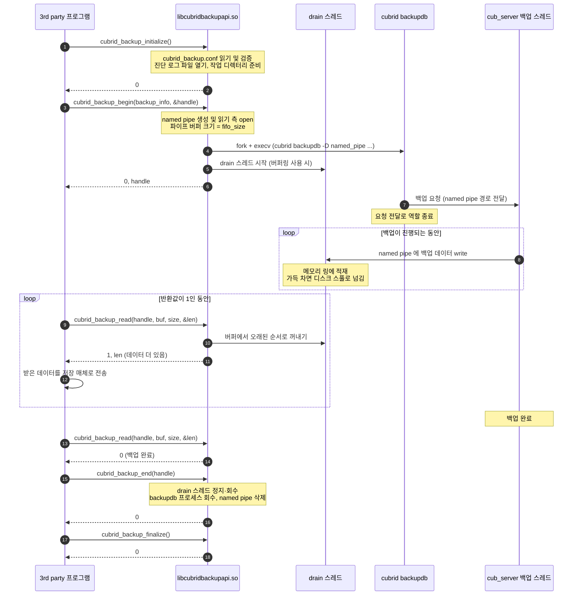
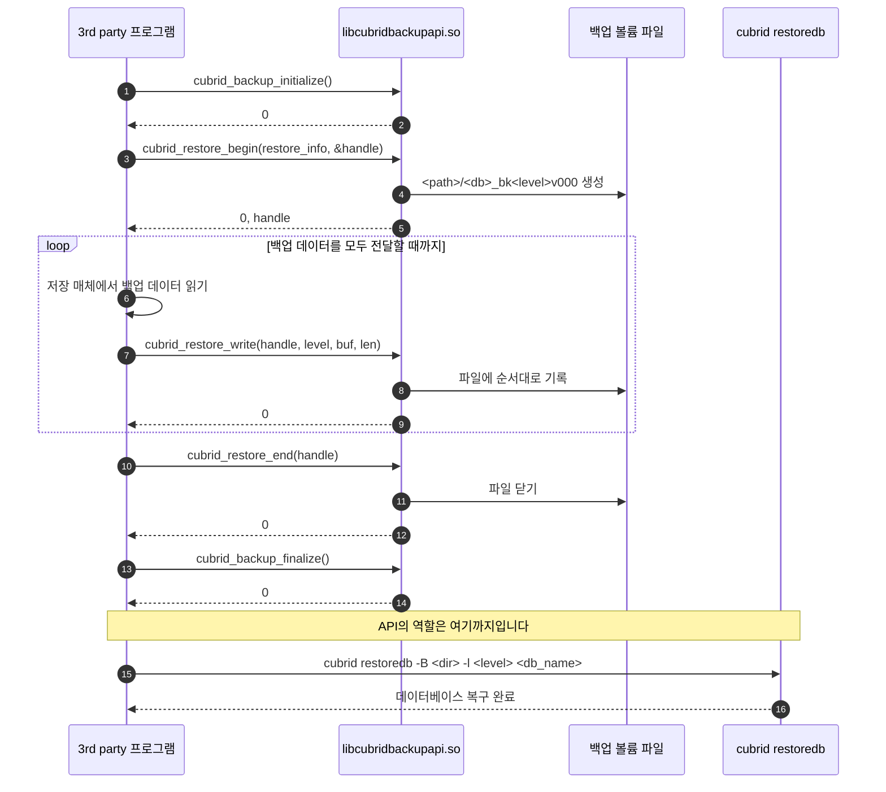
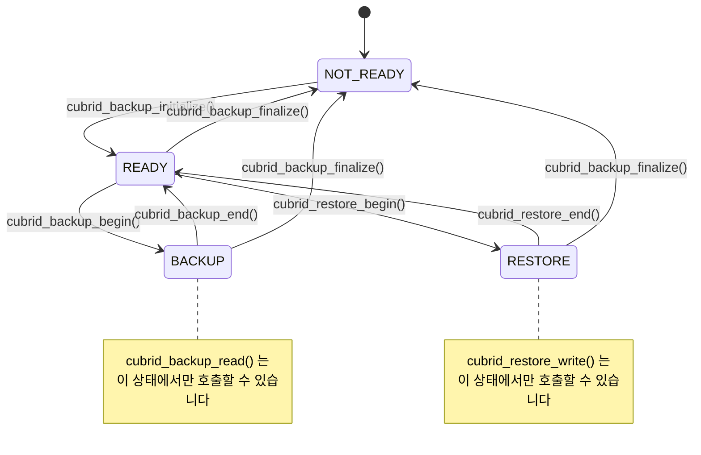

# cubrid-backup-api

**언어:** 한국어(이 문서) · [English](README.en.md)

3rd party 백업 솔루션이 CUBRID 데이터베이스의 백업과 복구를 직접 제어할 수 있도록 제공하는 C 라이브러리입니다.

---

## 목차

1. [cubrid-backup-api 소개](#1-cubrid-backup-api-소개)
2. [전체 구조와 동작 흐름](#2-전체-구조와-동작-흐름)
3. [설정 (cubrid_backup.conf)](#3-설정-cubrid_backupconf)
4. [데이터 구조](#4-데이터-구조)
5. [API 함수](#5-api-함수)
6. [API 호출 흐름 도식](#6-api-호출-흐름-도식)
7. [샘플 코드와 빌드 가이드](#7-샘플-코드와-빌드-가이드)
8. [저장소 구조와 테스트 수행 가이드](#8-저장소-구조와-테스트-수행-가이드)
9. [로그와 문제 해결](#9-로그와-문제-해결)
10. [제약 사항](#10-제약-사항)

---

## 1. cubrid-backup-api 소개

### 1.1 무엇을 하는 라이브러리인가

`cubrid-backup-api`는 백업 솔루션이 CUBRID의 백업 이미지를 **파일이 아닌 메모리 버퍼로 직접 주고받을 수 있게** 해주는 C 라이브러리입니다.

CUBRID의 기본 백업 도구인 `cubrid backupdb`는 백업 이미지를 디스크의 파일로 만듭니다. 백업 솔루션이 이 이미지를 테이프나 오브젝트 스토리지로 옮기려면 "① 로컬 디스크에 백업 파일 생성 → ② 그 파일을 다시 읽어 전송"이라는 두 단계를 거쳐야 하고, 백업 이미지 크기만큼의 임시 디스크 공간이 필요합니다.

이 라이브러리를 사용하면 그 중간 단계가 사라집니다. 애플리케이션은 `cubrid_backup_read()`를 반복 호출하면서 백업 데이터를 자신의 버퍼로 받아, 원하는 저장 매체로 바로 스트리밍할 수 있습니다. 복구는 그 반대 방향으로, `cubrid_restore_write()`에 백업 데이터를 되돌려 주는 방식입니다.

### 1.2 제공 파일

빌드 결과물은 헤더 파일 하나와 공유 라이브러리 하나입니다.

| 파일 | 설명 |
|---|---|
| `cubrid_backup_api.h` | 공개 헤더. 구조체, 열거형, 함수 원형이 모두 들어 있습니다. |
| `libcubridbackupapi.so` | 공유 라이브러리. 실제 파일은 `libcubridbackupapi.so.<major>.<minor>`이고 이 이름은 심볼릭 링크입니다. |

### 1.3 사용 전제 조건

| 항목 | 요구 사항 |
|---|---|
| 운영 체제 | Linux (POSIX). Windows는 지원하지 않습니다. |
| CUBRID | 백업 대상 데이터베이스 서버와 **동일한 호스트**에 CUBRID가 설치되어 있어야 합니다. |
| 환경 변수 | `CUBRID` 환경 변수가 CUBRID 설치 경로를 가리켜야 합니다. |
| 실행 권한 | `cubrid` 명령을 실행할 수 있는 사용자로 동작해야 합니다. 라이브러리가 내부적으로 `cubrid backupdb` 유틸리티를 실행하기 때문입니다. |
| 링크 | `libcubridbackupapi.so`와 `pthread`를 링크해야 합니다. |

**필요한 디렉터리 권한**

| 경로 | 권한 | 필요한 이유 |
|---|---|---|
| `$CUBRID` | 읽기 · 쓰기 · 실행 | `cubrid_backup_initialize()`가 이 경로가 사용 가능한 디렉터리인지 검사합니다. |
| `$CUBRID/log` | 쓰기 | API가 **자체 진단 로그 파일** `cubrid_backup.log`를 추가(append) 모드로 엽니다. 열지 못하면 `cubrid_backup_initialize()`가 실패합니다. 데이터베이스의 트랜잭션 로그(WAL)와는 무관한, 이 라이브러리 전용 로그입니다. |
| 임시 작업 디렉터리 | 읽기 · 쓰기 · 실행 | 이 디렉터리 아래에 `.cubrid_backup` 디렉터리를 만들고, 백업 데이터를 받을 named pipe를 생성합니다. 위치 선택 규칙은 [9.3 임시 작업 디렉터리](#93-임시-작업-디렉터리)를 참고하십시오. |

---

## 2. 전체 구조와 동작 흐름

### 2.1 큰 그림

백업 데이터는 CUBRID 서버(`cub_server`)에서 named pipe를 거쳐 애플리케이션으로 흘러 나옵니다. 이때 각 구성 요소가 맡는 역할이 서로 다르므로, 먼저 그 역할을 구분해서 볼 필요가 있습니다.

```
   3rd party 백업 프로그램 (사용자 프로세스)
   ┌─────────────────────────────────────────────────────┐
   │  application code                                   │
   │        ▲                                            │
   │        │  cubrid_backup_begin() / _read() / _end()  │
   │        ▼                                            │
   │  libcubridbackupapi.so   ←  cubrid_backup.conf      │
   └───┬─────────────────────────────────────────────▲───┘
       │ ① fork + execv                              │ ④ cubrid_backup_read() 로 읽기
       ▼                                             │
   ┌──────────────────────────────────────┐          │
   │  cubrid backupdb  (CUBRID 유틸리티)  │          │
   │  서버에 백업 요청만 전달             │          │
   └───┬──────────────────────────────────┘          │
       │ ② 백업 요청 (FIFO 경로 전달)                │
       ▼                                             │
   ┌──────────────────────────────────────┐          │
   │  cub_server                          │          │
   │    백업 스레드 (logpb_backup)        │          │
   └───┬──────────────────────────────────┘          │
       │ ③ 백업 데이터 쓰기                          │
       ▼                                             │
   ┌─────────────────────────────────────────────────┴┐
   │  named pipe (FIFO)                               │
   │  $CUBRID/tmp/.cubrid_backup/<db>_bk<level>v000   │
   └──────────────────────────────────────────────────┘
```

역할을 정리하면 다음과 같습니다.

| 구성 요소 | 역할 |
|---|---|
| `libcubridbackupapi.so` | named pipe를 만들고, `cubrid backupdb`를 실행하고, named pipe에서 백업 데이터를 읽어 애플리케이션에 전달합니다. |
| `cubrid backupdb` | `cub_server`에 "이 named pipe 경로에 백업하라"는 요청을 보냅니다. **요청 전달까지가 이 유틸리티의 역할입니다.** 백업 데이터를 직접 만들거나 쓰지 않습니다. |
| `cub_server` 백업 스레드 | 요청을 받아 실제 백업을 수행하고, 그 결과인 백업 데이터를 named pipe에 씁니다(`logpb_backup`). |
| named pipe (FIFO) | 서버가 쓰고 API가 읽는 통로입니다. 백업 이미지가 디스크 파일로 만들어지지 않는 것은 백업 대상 경로가 이 named pipe이기 때문입니다. |

> **참고** ①~④는 백업 요청과 데이터가 지나가는 경로를 나타냅니다. 애플리케이션이 호출해야 하는 함수의 순서는 [2.2](#22-백업-동작-메커니즘)에서 설명합니다.

복구는 방향이 반대입니다. 애플리케이션이 보관하던 백업 데이터를 API에 전달하면, API가 이를 **백업 볼륨 파일**로 재구성합니다. 그 파일을 이용한 실제 데이터베이스 복구는 CUBRID의 `cubrid restoredb` 명령으로 수행합니다.

### 2.2 백업 동작 메커니즘

```
 1. cubrid_backup_initialize()
      cubrid_backup.conf 읽기 및 검증
      API 진단 로그 파일($CUBRID/log/cubrid_backup.log) 열기
      임시 작업 디렉터리 준비

 2. cubrid_backup_begin()
      named pipe 생성 ──────► $CUBRID/tmp/.cubrid_backup/<db>_bk<level>v000
      named pipe 읽기 측 open + 파이프 버퍼 크기 설정 (fifo_size)
      cubrid backupdb 실행 (fork + execv)
      설정에 따라 메모리 링 · 디스크 스풀을 준비하고 drain 스레드 시작

 3. cubrid backupdb ──► cub_server
      2번에서 만든 named pipe 경로를 담아 백업을 요청합니다.
      요청을 전달하면 유틸리티의 역할은 끝납니다.

 4. cub_server 백업 스레드 (logpb_backup)
      백업을 수행하면서 백업 데이터를 named pipe에 씁니다.
      drain 스레드가 이 named pipe를 상시 읽어 계층형 버퍼에 적재합니다.

 5. cubrid_backup_read()
      버퍼에서 오래된 순서대로 꺼내 사용자 버퍼로 복사합니다.
      반환값 1: 읽을 데이터가 더 남았음 → 다시 호출
      반환값 0: 백업 완료

 6. cubrid_backup_end()
      drain 스레드 정지·회수, cubrid backupdb 프로세스 회수, named pipe 삭제

 7. cubrid_backup_finalize()
      임시 작업 디렉터리 정리, API 진단 로그 파일 닫기
```

여기서 **drain 스레드**는 named pipe를 상시 읽어내기 위해 API가 내부적으로 만드는 전용 스레드입니다. 이 스레드는 백업을 병렬로 수행하지 않으며, 오직 파이프를 비워 서버가 쓰기에서 막히지 않게 하는 역할만 합니다. 필요한 이유는 [2.3](#23-계층형-버퍼가-필요한-이유)에서 설명합니다.

5번에서 애플리케이션이 받는 바이트 스트림은 **`cubrid backupdb`로 직접 만든 백업 볼륨 파일과 완전히 동일합니다.** 애플리케이션이 이 스트림을 그대로 파일에 쓰면, 그 파일은 바이트 단위로 같은 내용이 됩니다.

> **참고** 위 흐름은 온라인 백업(`sa_mode` = 0) 기준입니다. 오프라인(stand-alone) 백업에서는 데이터베이스 서버 프로세스가 없으므로, `cubrid backupdb` 유틸리티가 직접 백업을 수행하고 named pipe에 씁니다.

### 2.3 계층형 버퍼가 필요한 이유

`cubrid_backup_read()`를 호출할 때만 named pipe를 읽는다면, 소비자(테이프 장치, 네트워크 업로드 등)가 느릴 때 파이프가 가득 찹니다. 파이프가 가득 차면 **`cub_server` 백업 스레드의 쓰기가 막힙니다.**

백업의 **로그 구간**(아카이브 로그 + 액티브 로그)은 서버가 전역 로그 임계 구역(`LOG_CS`)을 점유한 상태로 복사합니다. 따라서 이 구간에서 쓰기가 막히면 임계 구역 점유 시간이 길어지고, 결국 데이터베이스 전체의 커밋 지연으로 이어질 수 있습니다.

이를 완화하기 위해 API 내부에 계층형 버퍼를 둡니다. drain 스레드가 파이프를 상시 비워 주므로 서버 백업 스레드는 대기 없이 진행하고, 소비자의 지연은 API 내부 버퍼가 흡수합니다.

```
   cub_server 백업 스레드
                │ write()
                ▼
   ┌─────────────────────────┐
   │  FIFO  (fifo_size)      │
   └────────────┬────────────┘
                │ drain 스레드가 상시 비움
                ▼
   ┌─────────────────────────┐
   │  메모리 링              │  ← 오래된 데이터
   │  (buffer_memory_size)   │
   └────────────┬────────────┘
                │ 메모리가 가득 차면 넘김
                ▼
   ┌─────────────────────────┐
   │  디스크 스풀            │  ← 최신 데이터
   │  (buffer_disk_limit)    │
   └────────────┬────────────┘
                │
   ◄────────────┘
   cubrid_backup_read()
   메모리 → 디스크 순서로 꺼내므로 데이터 순서는 항상 보존됩니다.
```

동작 모드는 설정값에 따라 세 가지로 나뉩니다.

| 모드 | 설정 | 동작 |
|---|---|---|
| 버퍼링 없음 | `buffer_memory_size=0` (기본값) | drain 스레드를 만들지 않고, `cubrid_backup_read()`를 호출하는 시점에만 named pipe를 읽습니다. |
| 메모리 전용 | `buffer_memory_size>0`, `buffer_disk_limit=0` | drain 스레드가 파이프를 비워 메모리 링에 적재합니다. 링이 가득 차면 소비자가 읽어 갈 때까지 대기합니다. |
| 메모리 + 디스크 | `buffer_memory_size>0`, `buffer_disk_limit>0` | 메모리 링이 가득 차면 디스크 스풀로 넘깁니다. 버퍼 용량이 가장 크고, 로그 구간을 위해 디스크 예약분을 아껴 두는 정책이 활성화됩니다. |

> **참고** 버퍼링 설정은 백업 처리 속도와 서버 영향도만 바꿉니다. 어떤 모드를 사용해도 생성되는 백업 이미지는 바이트 단위로 동일합니다.
>
> **참고** 계층형 버퍼는 백업 경로에만 적용됩니다. 복구 경로에는 버퍼링이 없습니다.

### 2.4 복구 동작 메커니즘

복구는 백업 데이터를 API에 되돌려 주어 **백업 볼륨 파일을 재구성**하는 과정입니다.

```
 1. cubrid_backup_initialize()

 2. cubrid_restore_begin()
      복구 대상 파일 생성 ──► <backup_file_path>/<db_name>_bk<backup_level>v000

 3. cubrid_restore_write()
      전달받은 데이터를 파일에 순서대로 기록합니다.
      백업할 때 읽은 순서 그대로 전달해야 합니다.

 4. cubrid_restore_end()
      파일 닫기

 5. cubrid_backup_finalize()

 6. (CUBRID 명령) cubrid restoredb -B <디렉터리> -l <레벨> <db_name>
      재구성된 백업 볼륨으로 실제 데이터베이스를 복구합니다.
```

6번은 API의 역할이 아니라 CUBRID 유틸리티의 역할입니다. 현재 버전은 백업 데이터를 데이터베이스에 직접 반영하는 `RESTORE_TO_DB` 방식을 지원하지 않습니다.

---

## 3. 설정 (cubrid_backup.conf)

### 3.1 파일 위치와 문법

설정 파일 경로는 **`$CUBRID/conf/cubrid_backup.conf`** 로 고정되어 있습니다. 파일이 없으면 모든 항목이 기본값으로 동작하므로, 설정 파일은 선택 사항입니다.

```ini
[backup]
compress=true
thread_count=8

fifo_size=1MB
buffer_memory_size=64MB
buffer_disk_limit=256MB
buffer_disk_path=/var/tmp/cubrid_backup_spool
buffer_disk_keep_spool=false

[restore]
partial_recovery=false
```

> **주의** 위 예시를 그대로 사용하려면 `buffer_disk_path`로 지정한 디렉터리를 미리 만들어 두어야 합니다. 존재하지 않으면 `cubrid_backup_initialize()`가 실패합니다.

문법 규칙은 다음과 같습니다.

| 규칙 | 내용 |
|---|---|
| 섹션 | `[backup]`, `[restore]` 두 가지만 사용할 수 있습니다. 대소문자를 구분하지 않습니다. |
| 항목 | `키 = 값` 형식입니다. `=` 앞뒤 공백은 허용됩니다. |
| 키 문자 | 영문자와 `_`만 사용할 수 있습니다. 대소문자를 구분하지 않습니다. |
| 값 문자 | 영숫자와 `/`, `.`, `_`, `-` 만 사용할 수 있습니다. **공백이나 그 밖의 특수 문자는 사용할 수 없습니다.** |
| 주석 | `#`으로 시작하는 줄은 주석으로 취급되어 무시됩니다. 설정 항목을 잠시 비활성화하려면 `#thread_count=8` 처럼 줄 앞에 `#`을 붙이면 됩니다. |
| 빈 줄 | 무시됩니다. |
| 불리언 값 | `true`, `false`, `1`, `0` (대소문자 무시) |
| 크기 값 | 숫자 뒤에 `KB`, `MB`, `GB` 를 붙일 수 있습니다(1024 기준, 대소문자 무시). 접미사를 생략하면 바이트입니다. |

> **주의** 정의되지 않은 키를 쓰거나, 섹션 헤더보다 앞에 항목을 쓰거나, 값 형식이 잘못되면 `cubrid_backup_initialize()`가 실패합니다. 오타가 조용히 무시되지 않고 즉시 드러나는 구조입니다.

### 3.2 [backup] — 백업 동작 설정

`cubrid backupdb` 실행 옵션으로 그대로 전달되는 항목들입니다.

| 키 | 타입 | 기본값 | 설명 |
|---|---|---|---|
| `remove_archive` | 불리언 | `false` | `true`면 백업 완료 후 이후 백업에 더 이상 필요하지 않은 아카이브 로그 볼륨을 삭제합니다. |
| `sa_mode` | 불리언 | `false` | `false`면 온라인 백업(client/server 모드), `true`면 오프라인 백업(stand-alone 모드)입니다. `true`로 쓰려면 대상 데이터베이스 서버가 정지된 상태여야 합니다. |
| `no_check` | 불리언 | `false` | `true`면 백업 데이터에 대한 일관성 검사를 생략합니다. 백업 시간이 줄어듭니다. |
| `thread_count` | 정수 | `0` | 백업에 사용할 병렬 스레드 수입니다. `0`이면 옵션을 전달하지 않고 CUBRID 서버의 기본 동작을 따릅니다. |
| `compress` | 불리언 | `false` | `true`면 백업 데이터를 LZ4로 압축하고, `false`면 압축하지 않습니다. |
| `except_active_log` | 불리언 | `false` | `true`면 액티브 로그를 백업에서 제외합니다. |
| `sleep_msecs` | 정수 | `0` | 백업 중 데이터 읽기 사이에 넣을 대기 시간(밀리초)입니다. 서버 부하를 낮추는 용도로 사용하며, `0`이면 옵션을 전달하지 않습니다. |

> **참고** `cubrid backupdb`는 압축 관련 옵션을 주지 않으면 압축을 수행합니다. 그래서 이 라이브러리는 `compress=false`일 때 `--no-compress` 옵션을 명시적으로 전달합니다. 설정값과 실제 압축 여부는 항상 일치합니다.

### 3.3 [backup] — 계층형 버퍼 설정

| 키 | 타입 | 기본값 | 설명 |
|---|---|---|---|
| `fifo_size` | 크기 | `64KB` | 백업 데이터를 받는 named pipe의 커널 버퍼 크기입니다. `64KB` ~ `1MB` 범위를 벗어나면 경고를 남기고 범위 안으로 조정합니다. 서버 백업 스레드가 한 번에 쓰는 크기가 한 번에 담기도록 `1MB`를 권장합니다. |
| `buffer_memory_size` | 크기 | `0` | 메모리 링 버퍼 크기입니다. **`0`이면 버퍼링을 사용하지 않습니다.** `0`이 아니면 I/O 단위 이상이어야 하며, 그렇지 않으면 초기화가 실패합니다. |
| `buffer_disk_limit` | 크기 | `0` | 디스크 스풀 파일의 예약 크기입니다. `0`이면 디스크 계층을 사용하지 않습니다. `0`보다 크게 설정하려면 `buffer_memory_size`가 `0`보다 커야 합니다. |
| `buffer_disk_path` | 경로 | (없음) | 디스크 스풀 파일을 만들 디렉터리입니다. `buffer_disk_limit > 0`이면 반드시 지정해야 하고, 그 디렉터리가 존재하며 읽기·쓰기·실행 권한이 있어야 합니다. |
| `buffer_disk_keep_spool` | 불리언 | `false` | 기본값 `false`면 스풀 파일을 생성 직후 파일 시스템에서 지워, 백업이 끝나거나 프로세스가 비정상 종료해도 공간이 자동 회수됩니다. `true`면 스풀 파일을 남깁니다(디버깅 용도). |

**I/O 단위**란 API가 한 번에 읽고 쓰는 기준 크기로, 임시 작업 디렉터리가 속한 파일 시스템의 블록 크기 × 8 입니다. 일반적인 리눅스 파일 시스템에서는 4KB × 8 = **32KB** 입니다.

**용량 산정 지침**

- `buffer_memory_size`는 소비자가 일시적으로 느려질 때 흡수해야 할 데이터량으로 잡습니다. 64MB가 일반적인 출발점입니다.
- `buffer_disk_limit`은 데이터 볼륨 구간이 끝난 뒤 이어지는 **로그 구간 전체**(아카이브 로그 + 로그 정보 + 액티브 로그)를 담을 수 있는 크기로 잡습니다. 이 값이 부족하면 로그 구간에서 대기가 발생해 버퍼를 둔 효과가 줄어듭니다.
- `buffer_disk_limit`은 `fifo_size`보다 커야 의미가 있습니다. 파이프 한 번 분량도 담을 수 없으면 디스크 계층은 단순 오버플로 용도로만 동작합니다.
- 스풀 디렉터리의 여유 공간이 `buffer_disk_limit`보다 적으면 경고를 남기지만 초기화는 계속됩니다.

### 3.4 [restore] — 복구 설정

| 키 | 타입 | 기본값 | 설명 |
|---|---|---|---|
| `partial_recovery` | 불리언 | `false` | 예약된 항목입니다. |
| `use_database_location_path` | 불리언 | `false` | 예약된 항목입니다. |

> **참고** 두 항목은 설정 파일에서 정상적으로 파싱되지만, 현재 버전의 동작에는 영향을 주지 않습니다. 데이터베이스에 직접 복구하는 `RESTORE_TO_DB` 방식이 지원되면 함께 사용됩니다.

### 3.5 설정값이 결정되는 순서

백업 옵션은 세 단계를 거쳐 결정되며, **뒤 단계가 앞 단계를 덮어씁니다.**

```
   ① 라이브러리에 내장된 기본값
            │
            ▼  cubrid_backup.conf 에 해당 키가 있으면 덮어씀
   ② cubrid_backup.conf 값
            │
            ▼  CUBRID_BACKUP_INFO 멤버가 -1 이 아니면 덮어씀
   ③ CUBRID_BACKUP_INFO (API 인자) 값   ← 최종 적용값
```

`CUBRID_BACKUP_INFO`의 `remove_archive`, `sa_mode`, `no_check`, `compress` 네 멤버가 이 규칙을 따릅니다.

| 값 | 의미 |
|---|---|
| `-1` | API 인자로 덮어쓰지 않습니다. ②까지 결정된 값(설정 파일 값, 설정 파일에 없으면 내장 기본값)이 그대로 적용됩니다. |
| `0` | 해당 옵션을 사용하지 않습니다. 설정 파일 값을 무시합니다. |
| `1` | 해당 옵션을 사용합니다. 설정 파일 값을 무시합니다. |

예를 들어 `compress`의 최종 결과는 다음과 같습니다.

| 설정 파일 | API 인자 | 최종 결과 |
|---|---|---|
| 없음 | `-1` | 내장 기본값 → 압축하지 않음 |
| 없음 | `1` | 압축 |
| `compress=true` | `-1` | 압축 |
| `compress=true` | `0` | 압축하지 않음 |
| `compress=false` | `1` | 압축 |

나머지 항목은 지정할 수 있는 위치가 한 곳으로 정해져 있습니다.

| 항목 | 설정 위치 |
|---|---|
| `backup_level`, `db_name` | API 인자만 |
| `remove_archive`, `sa_mode`, `no_check`, `compress` | API 인자 또는 설정 파일 |
| `thread_count`, `except_active_log`, `sleep_msecs` | 설정 파일만 |
| `fifo_size`, `buffer_*` | 설정 파일만 |

### 3.6 잘못된 설정에 대한 동작

| 조건 | 동작 |
|---|---|
| `fifo_size`가 `64KB` 미만 | 경고 후 `64KB`로 조정하고 계속 진행 |
| `fifo_size`가 `1MB` 초과 | 경고 후 `1MB`로 조정하고 계속 진행 |
| 스풀 디렉터리 여유 공간 < `buffer_disk_limit` | 경고 후 계속 진행 |
| `buffer_memory_size`가 `0`이 아니면서 I/O 단위 미만 | `cubrid_backup_initialize()` 실패 |
| `buffer_disk_limit > 0`인데 `buffer_memory_size = 0` | `cubrid_backup_initialize()` 실패 |
| `buffer_disk_path`가 없거나 접근할 수 없음 | `cubrid_backup_initialize()` 실패 |
| 정의되지 않은 키, 섹션 밖의 항목, 잘못된 값 형식 | `cubrid_backup_initialize()` 실패 |

> **주의** 초기화 시점에 즉시 실패하는 항목들은 백업이 절반쯤 진행된 뒤에 문제가 드러나는 상황을 피하기 위한 것입니다. 설정을 바꾼 뒤에는 반드시 `cubrid_backup_initialize()`의 반환값을 확인하십시오.

---

## 4. 데이터 구조

공개 헤더 `cubrid_backup_api.h`에 선언된 구조체와 열거형입니다.

### 4.1 반환값 규약

모든 API 함수는 `int`를 반환합니다.

| 값 | 의미 |
|---|---|
| `0` | 성공. `cubrid_backup_read()`의 경우 "백업이 완료되었음"을 함께 의미합니다. |
| `1` | `cubrid_backup_read()` 전용. 성공했고 **읽을 데이터가 더 남아 있음**을 의미합니다. |
| `-1` | 실패. 상세 원인은 `$CUBRID/log/cubrid_backup.log`에 기록됩니다. |

### 4.2 CUBRID_BACKUP_INFO

백업을 요청할 때 필요한 정보를 담는 구조체입니다.

```c
typedef struct cubrid_backup_info CUBRID_BACKUP_INFO;
struct cubrid_backup_info
{
    int backup_level;
    int remove_archive;
    int sa_mode;
    int no_check;
    int compress;
    const char* db_name;
};
```

| 멤버 | 설정 가능한 값 | 설명 |
|---|---|---|
| `backup_level` | `0`, `1`, `2` | 백업 레벨입니다. `0` = 전체 백업, `1` = 1차 증분 백업, `2` = 2차 증분 백업. 범위를 벗어나면 `cubrid_backup_begin()`이 실패합니다. |
| `remove_archive` | `-1`, `0`, `1` | 백업 완료 후 불필요한 아카이브 로그 삭제 여부입니다. |
| `sa_mode` | `-1`, `0`, `1` | 백업 실행 모드입니다. `0` = 온라인 백업(client/server 모드), `1` = 오프라인 백업(stand-alone 모드). |
| `no_check` | `-1`, `0`, `1` | 백업 데이터 일관성 검사 여부입니다. `0` = 검사 수행, `1` = 검사 생략. |
| `compress` | `-1`, `0`, `1` | 백업 데이터 압축 여부입니다. `0` = 압축하지 않음, `1` = LZ4 압축. |
| `db_name` | 문자열 (`NULL` 불가) | 백업 대상 데이터베이스 이름입니다. 최대 511바이트입니다. |

`-1`, `0`, `1` 값의 의미와 설정 파일과의 관계는 [3.5 설정값이 결정되는 순서](#35-설정값이-결정되는-순서)를 참고하십시오.

> **주의** 구조체의 **모든 멤버를 반드시 초기화**하십시오. 지역 변수로 선언한 구조체의 멤버를 채우지 않으면 쓰레기 값이 검사 범위를 벗어나 `cubrid_backup_begin()`이 실패합니다. 설정 파일 값을 그대로 쓰고 싶은 항목에는 `-1`을 넣으십시오.

**db_name 에 사용할 수 있는 형식**

`dbname` 형식과 `dbname@hostname` 형식을 모두 쓸 수 있지만, `hostname`은 **API를 실행하는 호스트 자신**을 가리켜야 합니다. `localhost`, 해당 호스트의 이름, 또는 그 호스트의 IP 주소가 여기에 해당합니다.

원격 호스트의 데이터베이스는 지정할 수 없습니다. API는 named pipe를 **자신이 실행되는 호스트의 파일 시스템**에 만들고, 백업 데이터를 그 경로에 쓰는 주체는 데이터베이스 서버입니다. 원격 호스트의 서버를 지정하면 그 호스트에는 해당 경로가 없으므로 백업 데이터가 전달되지 않습니다. 이 경우 `cubrid_backup_begin()`은 성공하지만 이후 `cubrid_backup_read()`가 `-1`을 반환합니다.

### 4.3 CUBRID_RESTORE_INFO

복구를 요청할 때 필요한 정보를 담는 구조체입니다.

```c
typedef struct cubrid_restore_info CUBRID_RESTORE_INFO;
struct cubrid_restore_info
{
    RESTORE_TYPE restore_type;
    int backup_level;
    const char* up_to_date;      /* 형식: dd-mm-yyyy:hh:mm:ss */
    const char* backup_file_path;
    const char* db_name;
};
```

| 멤버 | 설정 가능한 값 | 설명 |
|---|---|---|
| `restore_type` | `RESTORE_TO_FILE` | 복구 방식입니다. 현재 버전은 `RESTORE_TO_FILE`만 지원하며, `RESTORE_TO_DB`를 지정하면 `cubrid_restore_begin()`이 실패합니다. |
| `backup_level` | `0`, `1`, `2` | 복구에 사용할 백업 데이터의 백업 레벨입니다. 생성되는 파일 이름과 `cubrid_restore_write()`에 전달하는 레벨이 이 값과 일치해야 합니다. |
| `up_to_date` | (미지원) | 지원하지 않습니다. `NULL`로 두십시오. 값을 넣어도 무시됩니다. |
| `backup_file_path` | 디렉터리 경로 (`NULL` 불가) | 백업 볼륨 파일을 만들 **디렉터리** 경로입니다. 미리 존재해야 하고 읽기·쓰기·실행 권한이 있어야 합니다. |
| `db_name` | 문자열 (`NULL` 불가) | 생성할 백업 볼륨 파일 이름에 사용됩니다. 최대 511바이트입니다. |

`cubrid_restore_begin()`이 만드는 파일의 경로는 다음과 같이 결정됩니다.

```
<backup_file_path>/<db_name>_bk<backup_level>v000

예) backup_file_path = "./restore_dir", db_name = "demodb", backup_level = 0
    ==> ./restore_dir/demodb_bk0v000
```

> **참고** 복구에서 `db_name`은 데이터베이스에 접속하는 데 쓰이지 않고, 만들 파일 이름을 정하는 데만 쓰입니다. 따라서 `dbname@hostname` 형식을 넣으면 `@hostname`까지 파일 이름에 포함됩니다. `cubrid restoredb`가 찾는 파일 이름과 맞추려면 백업할 때 사용한 데이터베이스 이름을 그대로 넣으십시오.
>
> **주의** 같은 이름의 파일이 이미 있으면 그 파일을 삭제하지 않고, 길이를 0으로 잘라낸 뒤 처음부터 다시 씁니다(`O_TRUNC`). 기존 내용은 모두 사라집니다. 새로 만들어지는 파일의 권한은 `0600`입니다. 원본 백업 데이터가 지워지지 않도록 원본 보관 위치와 복구 대상 디렉터리를 분리하십시오.

### 4.4 RESTORE_TYPE

`CUBRID_RESTORE_INFO.restore_type`에 사용하는 열거형입니다.

```c
typedef enum restore_type RESTORE_TYPE;
enum restore_type
{
    RESTORE_TO_DB,
    RESTORE_TO_FILE
};
```

| 멤버 | 설명 |
|---|---|
| `RESTORE_TO_DB` | 백업 데이터를 데이터베이스에 직접 반영합니다. **현재 지원하지 않습니다.** |
| `RESTORE_TO_FILE` | 백업 데이터를 `backup_file_path` 아래의 백업 볼륨 파일로 복원합니다. |

---

## 5. API 함수

함수는 세 묶음으로 나뉩니다. **공통** 함수는 백업과 복구 모두에서 사용합니다.

| 구분 | 함수 |
|---|---|
| 공통 | `cubrid_backup_initialize()`, `cubrid_backup_finalize()` |
| 백업 | `cubrid_backup_begin()`, `cubrid_backup_read()`, `cubrid_backup_end()` |
| 복구 | `cubrid_restore_begin()`, `cubrid_restore_write()`, `cubrid_restore_end()` |

### 5.1 호출 순서 규칙

API는 내부 상태를 검사하므로 아래 순서를 지켜야 하고, 어기면 해당 함수가 `-1`을 반환합니다.

```
  cubrid_backup_initialize()
        │
        ├── [백업]  cubrid_backup_begin() → cubrid_backup_read() 반복 → cubrid_backup_end()
        │
        └── [복구]  cubrid_restore_begin() → cubrid_restore_write() 반복 → cubrid_restore_end()
        │
  cubrid_backup_finalize()
```

- `cubrid_backup_initialize()`와 `cubrid_backup_finalize()`는 한 쌍으로 호출합니다. 초기화 없이 다른 함수를 호출하면 실패합니다.
- `_begin()` ~ `_end()` 한 묶음이 끝난 뒤에는, 같은 초기화 상태에서 다시 `_begin()`을 호출할 수 있습니다. 즉 한 번 초기화한 다음 여러 번의 백업을 순차적으로 수행할 수 있습니다.
- **백업과 복구를 동시에 진행할 수는 없습니다.** 백업이 진행 중일 때 `cubrid_restore_begin()`을 호출하면 실패합니다.
- 한 프로세스 안에서 **동시에 유효한 백업 핸들은 하나, 복구 핸들도 하나**입니다. 이미 백업이 진행 중일 때 `cubrid_backup_begin()`을 다시 호출하면 실패합니다.

### 5.2 cubrid_backup_initialize()

cubrid-backup-api를 사용하기 위해 가장 먼저 호출하는 함수입니다. 설정 파일을 읽어 검증하고, API 진단 로그 파일을 열고, 임시 작업 디렉터리를 준비합니다.

```c
int cubrid_backup_initialize (void);
```

**반환값**

| 값 | 설명 |
|---|---|
| `0` | 성공 |
| `-1` | 실패. `CUBRID` 환경 변수가 없거나, 로그 파일 또는 작업 디렉터리를 준비할 수 없거나, 설정 파일의 내용이 유효하지 않은 경우입니다. |

### 5.3 cubrid_backup_finalize()

`cubrid_backup_initialize()`와 짝을 이루는 함수로, cubrid-backup-api 사용을 종료합니다. 남아 있는 내부 자원을 정리하고 로그 파일을 닫습니다.

```c
int cubrid_backup_finalize (void);
```

**반환값**

| 값 | 설명 |
|---|---|
| `0` | 성공 |
| `-1` | 실패 |

> **주의** `_end()`를 호출하지 않은 상태에서 `cubrid_backup_finalize()`를 호출하면, 진행 중인 백업을 취소하고 내부 자원을 정리합니다. 이 경우 이미 받아 둔 백업 데이터는 완전하지 않으므로 사용해서는 안 됩니다.

### 5.4 cubrid_backup_begin()

백업을 시작합니다. 내부적으로 named pipe를 만들고 `cubrid backupdb`를 실행합니다. 이 함수는 백업이 끝날 때까지 기다리지 않고 즉시 반환합니다.

```c
int cubrid_backup_begin (CUBRID_BACKUP_INFO* backup_info, void** backup_handle);
```

**인자**

| 인자 | 입출력 | 설명 |
|---|---|---|
| `backup_info` | in | 백업 정보입니다. [CUBRID_BACKUP_INFO](#42-cubrid_backup_info)를 참고하십시오. `NULL`을 넘기면 실패합니다. |
| `backup_handle` | out | 백업을 식별하는 핸들을 받습니다. `cubrid_backup_read()`와 `cubrid_backup_end()`의 입력으로 사용합니다. |

**반환값**

| 값 | 설명 |
|---|---|
| `0` | 성공 |
| `-1` | 실패. `backup_info`의 값이 유효 범위를 벗어난 경우, 이미 다른 백업이 진행 중인 경우, named pipe 생성이나 `cubrid backupdb` 실행에 실패한 경우입니다. |

> **참고** 이 함수가 성공했다는 것은 백업 실행이 시작되었다는 뜻입니다. 데이터베이스 이름이 잘못된 경우처럼 CUBRID 서버 측에서 발생하는 오류는 이후 `cubrid_backup_read()`가 `-1`을 반환하는 형태로 드러납니다.

### 5.5 cubrid_backup_read()

백업 데이터를 읽습니다. 백업이 완료될 때까지 반복 호출합니다.

```c
int cubrid_backup_read (void* backup_handle,
                        void* buffer,
                        unsigned int buffer_size,
                        unsigned int* data_len);
```

**인자**

| 인자 | 입출력 | 설명 |
|---|---|---|
| `backup_handle` | in | `cubrid_backup_begin()`에서 받은 백업 핸들입니다. |
| `buffer` | out | 백업 데이터를 담을 사용자 버퍼입니다. |
| `buffer_size` | in | 사용자 버퍼의 크기입니다. `0`이면 실패합니다. |
| `data_len` | out | 사용자 버퍼에 실제로 복사된 데이터 크기입니다. |

**반환값**

| 값 | 설명 |
|---|---|
| `1` | 성공. 읽을 백업 데이터가 더 남아 있으므로 다시 호출해야 합니다. |
| `0` | 성공. 백업이 완료되었습니다. |
| `-1` | 실패. 백업이 중단되었거나 데이터가 잘렸음을 의미하므로, 지금까지 받은 데이터는 폐기해야 합니다. |

**사용 시 주의 사항**

- **종료 판단은 반환값으로만** 하십시오. 반환값이 `1`이면서 `data_len`이 `0`일 수 있습니다. 이 경우는 아직 데이터가 준비되지 않은 것일 뿐 백업이 끝난 것이 아니므로, 계속 호출해야 합니다.
- 반환값이 `0`일 때 `data_len`이 `0`보다 클 수 있습니다. **마지막 조각을 먼저 처리한 뒤에 반복을 종료**하십시오.
- `buffer_size`는 I/O 단위(일반적으로 32KB)의 배수로 잡는 것이 효율적입니다. 더 작아도 동작하지만 호출 횟수가 늘어납니다.
- 반환값이 `-1`이면 반복을 중단하고 `cubrid_backup_end()`로 정리한 뒤, 받은 데이터를 폐기하십시오.

### 5.6 cubrid_backup_end()

`cubrid_backup_begin()`으로 시작한 백업을 종료합니다. 내부 스레드와 `cubrid backupdb` 프로세스를 회수하고 named pipe를 제거합니다.

```c
int cubrid_backup_end (void* backup_handle);
```

**인자**

| 인자 | 입출력 | 설명 |
|---|---|---|
| `backup_handle` | in | `cubrid_backup_begin()`에서 받은 백업 핸들입니다. |

**반환값**

| 값 | 설명 |
|---|---|
| `0` | 성공 |
| `-1` | 실패 |

> **주의** `cubrid_backup_read()`가 `0`을 반환하기 전에 이 함수를 호출하면 백업을 **취소**하는 동작이 됩니다. 이때 이미 받아 둔 데이터는 잘린 상태이므로 사용할 수 없습니다.

### 5.7 cubrid_restore_begin()

복구를 시작합니다. `RESTORE_TO_FILE` 방식에서는 백업 볼륨 파일을 만들고 쓰기를 준비합니다.

```c
int cubrid_restore_begin (CUBRID_RESTORE_INFO* restore_info, void** restore_handle);
```

**인자**

| 인자 | 입출력 | 설명 |
|---|---|---|
| `restore_info` | in | 복구 정보입니다. [CUBRID_RESTORE_INFO](#43-cubrid_restore_info)를 참고하십시오. `NULL`을 넘기면 실패합니다. |
| `restore_handle` | out | 복구를 식별하는 핸들을 받습니다. `cubrid_restore_write()`와 `cubrid_restore_end()`의 입력으로 사용합니다. |

**반환값**

| 값 | 설명 |
|---|---|
| `0` | 성공 |
| `-1` | 실패. `restore_type`이 `RESTORE_TO_DB`인 경우, `backup_level`이 범위를 벗어난 경우, `backup_file_path`가 없거나 접근할 수 없는 경우, 이미 다른 복구가 진행 중인 경우입니다. |

### 5.8 cubrid_restore_write()

보관하고 있던 백업 데이터를 API에 전달합니다. 백업 데이터를 모두 전달할 때까지 반복 호출합니다.

```c
int cubrid_restore_write (void* restore_handle,
                          int backup_level,
                          void* buffer,
                          unsigned int data_len);
```

**인자**

| 인자 | 입출력 | 설명 |
|---|---|---|
| `restore_handle` | in | `cubrid_restore_begin()`에서 받은 복구 핸들입니다. |
| `backup_level` | in | 전달하는 백업 데이터의 백업 레벨입니다. `cubrid_restore_begin()`에 지정한 `backup_level`과 **같아야** 합니다. |
| `buffer` | in | 백업 데이터가 담긴 사용자 버퍼입니다. |
| `data_len` | in | 사용자 버퍼에 담긴 실제 데이터 크기입니다. |

**반환값**

| 값 | 설명 |
|---|---|
| `0` | 성공 |
| `-1` | 실패. `backup_level`이 `cubrid_restore_begin()`에 지정한 값과 다르거나, 범위를 벗어난 경우, 또는 파일 쓰기가 실패한 경우입니다. |

> **주의** 백업할 때 `cubrid_backup_read()`로 읽은 순서 그대로 전달해야 합니다. 순서가 어긋나거나 일부가 빠지면 복구된 백업 볼륨 파일이 손상됩니다.

### 5.9 cubrid_restore_end()

`cubrid_restore_begin()`으로 시작한 복구를 종료하고 백업 볼륨 파일을 닫습니다.

```c
int cubrid_restore_end (void* restore_handle);
```

**인자**

| 인자 | 입출력 | 설명 |
|---|---|---|
| `restore_handle` | in | `cubrid_restore_begin()`에서 받은 복구 핸들입니다. |

**반환값**

| 값 | 설명 |
|---|---|
| `0` | 성공 |
| `-1` | 실패 |

---

## 6. API 호출 흐름 도식

2절이 개념 이해를 위한 도식이라면, 이 절은 **어떤 함수를 어떤 순서로 호출하면 내부에서 무엇이 일어나는지**를 보여 줍니다.

### 6.1 백업 — 호출 시퀀스



### 6.2 복구 — 호출 시퀀스



### 6.3 내부 상태 전이

API는 하나의 내부 상태를 가지며, 호출 순서가 이 상태와 맞지 않으면 함수가 `-1`을 반환합니다.



### 6.4 반복 구조 의사 코드

호출 루프에서 가장 흔한 실수는 종료 조건을 `data_len`으로 판단하는 것입니다. 아래 형태를 그대로 따르십시오.

**백업**

```
if (cubrid_backup_initialize() < 0)            → 오류 처리
if (cubrid_backup_begin(&info, &handle) < 0)   → finalize 후 오류 처리

무한 반복 {
    rc = cubrid_backup_read(handle, buf, size, &len)

    if (rc < 0)                → 반복 중단, end + finalize, 받은 데이터 폐기
    if (len > 0)               → buf 의 len 바이트를 저장 매체로 전송
    if (rc == 0)               → 반복 종료          ← 종료 판단은 rc 로만
}

cubrid_backup_end(handle)
cubrid_backup_finalize()
```

**복구**

```
if (cubrid_backup_initialize() < 0)              → 오류 처리
if (cubrid_restore_begin(&info, &handle) < 0)    → finalize 후 오류 처리

반복 {
    len = 저장 매체에서 백업 데이터 읽기      ← 백업 시 읽은 순서 그대로
    if (len == 0)  → 반복 종료

    if (cubrid_restore_write(handle, level, buf, len) < 0)
        → 반복 중단, end + finalize, 오류 처리
}

cubrid_restore_end(handle)
cubrid_backup_finalize()
```

---

## 7. 샘플 코드와 빌드 가이드

### 7.1 라이브러리 빌드

```sh
./build.sh              # 64비트 release 빌드 (RelWithDebInfo)
./build.sh -m debug     # 64비트 debug 빌드
```

빌드가 끝나면 아래 위치에 결과물이 만들어집니다. `<version>`은 저장소 루트의 `VERSION` 파일 값입니다.

```
build_x86_64_release/_install/cubrid-backup-api/
├── cubrid_backup_api.h
├── libcubridbackupapi.so -> libcubridbackupapi.so.<version>
└── libcubridbackupapi.so.<version>

build_x86_64_release/cubrid-backup-api-<version>-Linux.x86_64.tar.gz   # 배포용 패키지
```

> **주의** `build.sh`는 시작할 때 `git clean -ffdx`를 실행하여 작업 트리를 정리합니다. 저장소 안에 커밋하지 않은 파일이 있으면 삭제되므로, 소스를 추가한 경우 먼저 `git add` 하십시오.

배포용 패키지를 풀어 사용하려면 다음과 같이 합니다.

```sh
tar xzf cubrid-backup-api-<version>-Linux.x86_64.tar.gz
# ==> cubrid-backup-api/{cubrid_backup_api.h, libcubridbackupapi.so, libcubridbackupapi.so.<version>}
```

### 7.2 백업 샘플 코드

`backup_sample.c` — 데이터베이스를 백업해 파일로 저장합니다.

```c
/*
 * usage: ./backup_sample <db_name> <backup_level> <output_file>
 */

#include <stdio.h>
#include <stdlib.h>
#include <string.h>
#include "cubrid_backup_api.h"

#define READ_BUFFER_SIZE (1024 * 1024)

int main (int argc, char *argv[])
{
    CUBRID_BACKUP_INFO backup_info;
    void *backup_handle = NULL;

    char *read_buffer = NULL;
    unsigned int data_len = 0;
    unsigned long long total_len = 0;

    FILE *out_fp = NULL;
    int retval;

    if (argc != 4)
    {
        fprintf (stderr, "usage: %s <db_name> <backup_level> <output_file>\n", argv[0]);
        return 1;
    }

    read_buffer = malloc (READ_BUFFER_SIZE);
    if (read_buffer == NULL)
    {
        fprintf (stderr, "[ERROR] out of memory\n");
        return 1;
    }

    out_fp = fopen (argv[3], "wb");
    if (out_fp == NULL)
    {
        fprintf (stderr, "[ERROR] cannot open %s\n", argv[3]);
        free (read_buffer);
        return 1;
    }

    /* 모든 멤버를 명시적으로 설정합니다. -1 은 cubrid_backup.conf 값을 사용하라는 뜻입니다. */
    memset (&backup_info, 0, sizeof (backup_info));
    backup_info.backup_level   = atoi (argv[2]);
    backup_info.remove_archive = -1;
    backup_info.sa_mode        = -1;
    backup_info.no_check       = -1;
    backup_info.compress       = -1;
    backup_info.db_name        = argv[1];

    if (cubrid_backup_initialize () < 0)
    {
        fprintf (stderr, "[ERROR] cubrid_backup_initialize ()\n");
        goto error;
    }

    if (cubrid_backup_begin (&backup_info, &backup_handle) < 0)
    {
        fprintf (stderr, "[ERROR] cubrid_backup_begin ()\n");
        cubrid_backup_finalize ();
        goto error;
    }

    for (;;)
    {
        retval = cubrid_backup_read (backup_handle, read_buffer, READ_BUFFER_SIZE, &data_len);

        if (retval < 0)
        {
            fprintf (stderr, "[ERROR] cubrid_backup_read ()\n");
            cubrid_backup_end (backup_handle);
            cubrid_backup_finalize ();
            goto error;
        }

        if (data_len > 0)
        {
            if (fwrite (read_buffer, 1, data_len, out_fp) != data_len)
            {
                fprintf (stderr, "[ERROR] fwrite ()\n");
                cubrid_backup_end (backup_handle);
                cubrid_backup_finalize ();
                goto error;
            }

            total_len += data_len;
        }

        if (retval == 0)   /* 0: 백업 완료, 1: 읽을 데이터가 더 있음 */
        {
            break;
        }
    }

    if (cubrid_backup_end (backup_handle) < 0)
    {
        fprintf (stderr, "[ERROR] cubrid_backup_end ()\n");
        cubrid_backup_finalize ();
        goto error;
    }

    if (cubrid_backup_finalize () < 0)
    {
        fprintf (stderr, "[ERROR] cubrid_backup_finalize ()\n");
        goto error;
    }

    fclose (out_fp);
    free (read_buffer);

    printf ("[OK] backup done: %llu bytes -> %s\n", total_len, argv[3]);

    return 0;

error:

    fclose (out_fp);
    free (read_buffer);

    return 1;
}
```

### 7.3 복구 샘플 코드

`restore_sample.c` — 보관하고 있던 백업 데이터를 백업 볼륨 파일로 복원합니다.

```c
/*
 * usage: ./restore_sample <db_name> <backup_level> <input_file> <output_dir>
 *
 * 결과 파일 경로: <output_dir>/<db_name>_bk<backup_level>v000
 */

#include <stdio.h>
#include <stdlib.h>
#include <string.h>
#include "cubrid_backup_api.h"

#define WRITE_BUFFER_SIZE (1024 * 1024)

int main (int argc, char *argv[])
{
    CUBRID_RESTORE_INFO restore_info;
    void *restore_handle = NULL;

    char *write_buffer = NULL;
    size_t data_len = 0;
    unsigned long long total_len = 0;

    FILE *in_fp = NULL;
    int backup_level;

    if (argc != 5)
    {
        fprintf (stderr, "usage: %s <db_name> <backup_level> <input_file> <output_dir>\n", argv[0]);
        return 1;
    }

    backup_level = atoi (argv[2]);

    write_buffer = malloc (WRITE_BUFFER_SIZE);
    if (write_buffer == NULL)
    {
        fprintf (stderr, "[ERROR] out of memory\n");
        return 1;
    }

    in_fp = fopen (argv[3], "rb");
    if (in_fp == NULL)
    {
        fprintf (stderr, "[ERROR] cannot open %s\n", argv[3]);
        free (write_buffer);
        return 1;
    }

    memset (&restore_info, 0, sizeof (restore_info));
    restore_info.restore_type     = RESTORE_TO_FILE;
    restore_info.backup_level     = backup_level;
    restore_info.up_to_date       = NULL;      /* 미지원 */
    restore_info.backup_file_path = argv[4];
    restore_info.db_name          = argv[1];

    if (cubrid_backup_initialize () < 0)
    {
        fprintf (stderr, "[ERROR] cubrid_backup_initialize ()\n");
        goto error;
    }

    if (cubrid_restore_begin (&restore_info, &restore_handle) < 0)
    {
        fprintf (stderr, "[ERROR] cubrid_restore_begin ()\n");
        cubrid_backup_finalize ();
        goto error;
    }

    while ((data_len = fread (write_buffer, 1, WRITE_BUFFER_SIZE, in_fp)) > 0)
    {
        if (cubrid_restore_write (restore_handle, backup_level, write_buffer, (unsigned int) data_len) < 0)
        {
            fprintf (stderr, "[ERROR] cubrid_restore_write ()\n");
            cubrid_restore_end (restore_handle);
            cubrid_backup_finalize ();
            goto error;
        }

        total_len += data_len;
    }

    if (ferror (in_fp))
    {
        fprintf (stderr, "[ERROR] fread ()\n");
        cubrid_restore_end (restore_handle);
        cubrid_backup_finalize ();
        goto error;
    }

    if (cubrid_restore_end (restore_handle) < 0)
    {
        fprintf (stderr, "[ERROR] cubrid_restore_end ()\n");
        cubrid_backup_finalize ();
        goto error;
    }

    if (cubrid_backup_finalize () < 0)
    {
        fprintf (stderr, "[ERROR] cubrid_backup_finalize ()\n");
        goto error;
    }

    fclose (in_fp);
    free (write_buffer);

    printf ("[OK] restore done: %llu bytes -> %s/%s_bk%dv000\n",
            total_len, argv[4], argv[1], backup_level);

    return 0;

error:

    fclose (in_fp);
    free (write_buffer);

    return 1;
}
```

### 7.4 샘플 코드 컴파일

헤더와 라이브러리가 `./cubrid-backup-api` 디렉터리에 있다고 가정합니다.

```sh
gcc -o backup_sample  backup_sample.c  \
    -I ./cubrid-backup-api -L ./cubrid-backup-api -lcubridbackupapi -lpthread

gcc -o restore_sample restore_sample.c \
    -I ./cubrid-backup-api -L ./cubrid-backup-api -lcubridbackupapi -lpthread
```

실행 시에는 공유 라이브러리를 찾을 수 있도록 경로를 지정해야 합니다.

```sh
export LD_LIBRARY_PATH=$PWD/cubrid-backup-api:$CUBRID/lib:$LD_LIBRARY_PATH
```

> **참고** 링크 시점에 `-Wl,-rpath,<라이브러리 경로>`를 추가하면 실행할 때마다 `LD_LIBRARY_PATH`를 설정하지 않아도 됩니다.

### 7.5 동작 확인 절차

아래는 백업 → 복구 → 실제 데이터베이스 복구까지 한 번에 확인하는 절차입니다.

**① 환경 준비**

```sh
export CUBRID=/path/to/CUBRID
export PATH=$CUBRID/bin:$PATH
export LD_LIBRARY_PATH=$PWD/cubrid-backup-api:$CUBRID/lib:$LD_LIBRARY_PATH

mkdir -p backup_dir restore_dir
```

**② 테스트 데이터베이스 준비**

```sh
cubrid service start
cubrid createdb -r --db-volume-size=100M --log-volume-size=100M bkdb en_US
cubrid server start bkdb

csql -u dba -c "CREATE TABLE t(a INT PRIMARY KEY, b VARCHAR(200));" bkdb
csql -u dba -c "INSERT INTO t VALUES (1, RPAD('x',180,'y'));" bkdb
# 필요한 만큼 데이터를 채웁니다.
```

**③ 백업**

```sh
./backup_sample bkdb 0 ./backup_dir/bkdb_bk0v000
```

`[OK] backup done: ... bytes` 가 출력되어야 합니다.

**④ 복구 (백업 볼륨 파일 재구성)**

```sh
./restore_sample bkdb 0 ./backup_dir/bkdb_bk0v000 ./restore_dir

# 재구성된 파일이 원본과 동일한지 확인
cmp ./backup_dir/bkdb_bk0v000 ./restore_dir/bkdb_bk0v000 && echo "동일함"
```

**⑤ 데이터베이스 복구로 최종 확인**

```sh
cubrid server stop bkdb
rm -f bkdb bkdb_dwb bkdb_keys bkdb_lgar_t bkdb_lgat bkdb_lgat__lock bkdb_lginf bkdb_vinf bkdb_bkvinf

printf '0\n' | cubrid restoredb -B ./restore_dir -l 0 bkdb

cubrid server start bkdb
csql -u dba -N -c "SELECT COUNT(*) FROM t" bkdb        # 백업 시점의 건수와 일치하는지 확인
```

> **참고** `cubrid restoredb`는 백업 볼륨 위치를 확인하는 프롬프트를 띄울 수 있습니다. `-B` 옵션으로 준 디렉터리를 사용하려면 `0`을 입력합니다. 위 예시에서는 `printf '0\n' |` 로 이 입력을 전달했습니다.

**⑥ 정리**

```sh
cubrid server stop bkdb
cubrid deletedb bkdb
cubrid service stop
```

**확인해야 할 결과**

| 단계 | 정상 결과 |
|---|---|
| ③ 백업 | `[OK] backup done` 출력, 백업 파일 생성 |
| ④ 복구 | `[OK] restore done` 출력, `cmp` 결과가 동일 |
| ⑤ 데이터베이스 복구 | `cubrid restoredb` 성공, 서버 정상 기동, 건수가 백업 시점과 일치 |

계층형 버퍼를 사용하는 설정으로도 같은 절차를 반복해, 백업 이미지가 동일하게 복구되는지 확인할 수 있습니다. 이때 `$CUBRID/log/cubrid_backup.log`에 남는 요약 정보로 버퍼가 실제로 동작했는지 확인하십시오([9.1](#91-로그-파일) 참고).

---

## 8. 저장소 구조와 테스트 수행 가이드

### 8.1 저장소 구조

```
cubrid-backup-api/
├── build.sh                   빌드 스크립트
├── VERSION                    패키지 버전
├── README.md                  이 문서 (한국어)
├── README.en.md               영문 문서
│
├── src/                       라이브러리 구현
│   ├── CMakeLists.txt
│   ├── backup_api.c           공개 API 진입점 (인자 검사 및 호출 순서 확인)
│   ├── backup_core.c          백업·복구 실행, 계층형 버퍼, 로그 구간 파서
│   ├── backup_manager.c       설정 파일 파싱, 로그, 작업 디렉터리 관리
│   ├── handle_manager.c       백업·복구 핸들 수명 관리
│   └── include/
│       ├── backup_api.h       공개 헤더 (설치 시 cubrid_backup_api.h 로 이름 변경)
│       ├── backup_common.h
│       ├── backup_core.h
│       ├── backup_manager.h
│       ├── handle_manager.h
│       └── cubrid_backup_format.h
│
└── testcases/                 테스트
    ├── CMakeLists.txt
    ├── run_test.sh            기능 회귀 테스트 (전체 실행 진입점)
    ├── conf_test.sh           설정 파일 항목별 검증
    ├── run_logphase_e2e.sh    개발용 단독 e2e 스크립트 (경로가 하드코딩되어 있으므로 수정 후 사용)
    ├── cubrid_backup.conf     설정 파일 예시
    ├── backup_tc01 ~ 05.c     백업 테스트 클라이언트
    ├── restore_tc01 ~ 03.c    복구 테스트 클라이언트
    ├── parser_ut.c            로그 구간 파서·버퍼 단위 테스트 (서버 불필요)
    ├── backup_dir/            테스트 산출물 디렉터리
    ├── restore_dir/           테스트 산출물 디렉터리
    └── stress/                대용량·실환경 테스트 스위트 (선택 실행)
        ├── run_stress.sh
        ├── s01 ~ s11_*.sh
        └── helpers/
```

### 8.2 기능 회귀 테스트

`testcases/run_test.sh`가 전체 진입점입니다. 라이브러리와 테스트 클라이언트를 빌드하고, 100MB 규모의 `testdb`를 만들어 백업·복구 시나리오를 순서대로 실행합니다.

```sh
export CUBRID=/path/to/CUBRID
export PATH=$CUBRID/bin:$PATH

cd testcases
sh run_test.sh
```

수행 시간은 수 분이며, 마지막에 판정 결과를 출력합니다.

```
===================
ALL PASSED
===================
```

실패한 항목이 있으면 `FAILED TEST SUMMARY` 아래에 테스트 이름이 나열됩니다. 항목별 상세 결과는 `testcases/<테스트이름>_result` 파일에 `[OK]` / `[NOK]` 형태로 기록됩니다.

> **주의** 이 스크립트는 `testdb` 데이터베이스를 만들고 지우며, `$CUBRID/conf/cubrid_backup.conf`와 `$CUBRID/log/` 아래 파일을 삭제합니다. **운영 중인 CUBRID 설치본에서 실행하지 마십시오.** 테스트 전용 설치본을 사용하십시오.

각 테스트가 확인하는 내용은 다음과 같습니다.

| 테스트 | 확인 내용 |
|---|---|
| `backup_tc01` | 레벨 0/1/2 백업 수행, `cubrid_utility.log` 기록 확인, `cubrid restoredb`로 실제 복구 가능한지 확인 |
| `backup_tc02` | 호출 순서를 어겼을 때(초기화 없이 호출, 핸들 중복 사용 등) 정상적으로 실패하는지 확인 |
| `backup_tc03` | 잘못된 인자(존재하지 않는 데이터베이스 이름, 범위를 벗어난 백업 레벨 등)에 대한 처리 확인 |
| `backup_tc04` | `CUBRID_BACKUP_INFO`의 옵션 조합이 실제 `cubrid backupdb` 명령행으로 정확히 전달되는지 확인 |
| `backup_tc05` | 느린 소비자 상황을 재현하여 계층형 버퍼(메모리 → 디스크 → 대기)를 동작시키고, 그렇게 만든 백업이 바이트 단위로 동일하게 복구되는지 확인 |
| `restore_tc01` | 레벨 0/1/2 복구 수행 후 원본 백업 파일과 바이트 단위 비교 |
| `restore_tc02` | 복구 API의 호출 순서 위반 처리 확인 |
| `restore_tc03` | 복구 API의 잘못된 인자 처리 확인 |
| `parser_ut` | 로그 구간 파서와 버퍼의 단위 테스트. 합성 데이터로 동작하므로 CUBRID 서버가 필요하지 않습니다. |
| `conf_test` | 설정 파일의 각 항목이 `cubrid backupdb` 명령행 옵션으로 올바르게 반영되는지 확인 |

단위 테스트만 따로 실행할 수도 있습니다. 서버가 필요하지 않아 가장 빠릅니다.

```sh
cd testcases
./parser_ut ; echo "exit=$?"      # 0 이면 모든 검사 통과
```

### 8.3 대용량·실환경 테스트 스위트

`testcases/stress/`는 수십 GB 규모의 데이터와 장애 상황을 포함하는 무거운 테스트로, 기능 회귀 테스트에서 의도적으로 분리되어 있습니다. 수 분에서 수 시간이 걸립니다.

```sh
cd testcases/stress

CUBRID=/path/to/CUBRID bash run_stress.sh quick       # 가벼운 스위트만
CUBRID=/path/to/CUBRID bash run_stress.sh standard    # 기본값: 대용량 스위트 제외 전체
CUBRID=/path/to/CUBRID bash run_stress.sh full        # 30GB, 150GB 스위트까지 포함

CUBRID=/path/to/CUBRID bash run_stress.sh s01_param_sweep s09_fault_boundary   # 지정 실행
```

스위트별 검증 내용, 프로파일 구성, 환경 변수는 [`testcases/stress/README.md`](testcases/stress/README.md)에 정리되어 있습니다.

---

## 9. 로그와 문제 해결

### 9.1 로그 파일

| 파일 | 내용 |
|---|---|
| `$CUBRID/log/cubrid_backup.log` | 이 라이브러리의 진단 로그입니다. 오류 발생 위치, 설정 관련 경고, 계층형 버퍼 요약이 기록됩니다. 데이터베이스의 트랜잭션 로그와는 무관합니다. |
| `$CUBRID/log/cubrid_utility.log` | CUBRID 유틸리티 로그입니다. API가 실행한 `cubrid backupdb` 명령행 전체가 기록되므로, 설정이 의도대로 전달되었는지 확인할 수 있습니다. |

로그의 각 줄은 `연-월-일 시:분:초.밀리초 (PID) 수준: 메시지` 형식입니다. 수준은 `INFO`, `WARNING`, `ERROR` 세 가지입니다.

계층형 버퍼를 사용한 백업이 끝나면 요약 한 줄이 남습니다. 튜닝에 참고할 수 있습니다.

```
26-08-03 05:32:31.673 (1033546) INFO: log-phase boundary detected (~1061888 bytes in); reserved spool armed
26-08-03 05:32:31.806 (1033546) INFO: tiered buffer summary: log_phase=1 spilled=0 mem_high_water=1061888 disk_high_water=0 wait_count=0 lookahead=0 bytes_total=5256192
```

| 항목 | 의미 |
|---|---|
| `log_phase` | 로그 구간 경계를 감지했는지 여부(`1` = 감지) |
| `spilled` | 디스크 스풀을 사용했는지 여부 |
| `mem_high_water` | 메모리 링 최대 사용량(바이트) |
| `disk_high_water` | 디스크 스풀 최대 사용량(바이트) |
| `wait_count` | 버퍼가 가득 차서 대기한 횟수. 값이 크면 버퍼 크기를 늘리는 것을 검토하십시오. |
| `bytes_total` | 버퍼를 통과한 총 바이트 수 |

### 9.2 자주 발생하는 문제

| 증상 | 원인과 조치 |
|---|---|
| `cubrid_backup_initialize()`가 `-1`을 반환한다 | `CUBRID` 환경 변수가 설정되지 않았거나, `$CUBRID/log` 또는 임시 작업 디렉터리에 쓰기 권한이 없거나, 설정 파일에 유효하지 않은 항목이 있습니다. `cubrid_backup.conf`의 키 이름 오타를 먼저 확인하십시오. |
| `cubrid_backup_begin()`이 `-1`을 반환한다 | `CUBRID_BACKUP_INFO`의 멤버가 초기화되지 않았거나 값이 범위를 벗어났습니다. 설정 파일 값을 쓰려는 항목에 `-1`을 넣었는지 확인하십시오. 같은 프로세스에서 이미 백업이 진행 중일 때도 실패합니다. |
| `cubrid_backup_begin()`은 성공했는데 첫 `cubrid_backup_read()`가 `-1`을 반환한다 | CUBRID 서버 측 오류입니다. 데이터베이스 이름이 정확한지, 서버가 실행 중인지(온라인 백업), 또는 정지되어 있는지(`sa_mode=1`), `db_name`에 원격 호스트를 지정하지 않았는지 확인하십시오. `$CUBRID/log/cubrid_utility.log`에 원인이 남습니다. |
| 백업이 진행되지 않고 오래 멈춘 것처럼 보인다 | 소비자가 데이터를 받아 가지 못해 버퍼가 가득 찬 상태일 수 있습니다. `cubrid_backup_read()`를 계속 호출하고 있는지 확인하고, 버퍼 요약의 `wait_count`를 참고해 `buffer_memory_size`와 `buffer_disk_limit`을 늘려 보십시오. |
| 복구한 백업 파일로 `cubrid restoredb`가 실패한다 | `cubrid_restore_write()`에 데이터를 백업 시 읽은 순서 그대로 전달했는지, 중간에 누락된 조각이 없는지 확인하십시오. `cubrid_backup_read()`가 `-1`을 반환한 백업의 데이터는 사용할 수 없습니다. |
| 임시 작업 디렉터리에 named pipe 파일이 남아 있다 | 클라이언트가 `cubrid_backup_end()`와 `cubrid_backup_finalize()`를 거치지 않고 종료하면 파일이 남을 수 있습니다. 같은 데이터베이스·레벨로 다시 `cubrid_backup_begin()`을 호출하면 자동으로 지우고 새로 만들기 때문에 별도 조치는 필요하지 않습니다. |
| 여러 백업이 동시에 실행되면서 서로 실패한다 | 같은 데이터베이스·같은 백업 레벨의 백업을 여러 프로세스에서 동시에 수행하면 내부 named pipe 경로가 충돌합니다. [10. 제약 사항](#10-제약-사항)을 참고하십시오. |

### 9.3 임시 작업 디렉터리

API는 named pipe를 만들 임시 작업 디렉터리를 아래 순서로 찾고, 그 아래에 `.cubrid_backup` 디렉터리를 만들어 사용합니다.

1. `$CUBRID/tmp`
2. `$CUBRID_TMP` (환경 변수가 설정되어 있고 접근 가능한 경우)
3. `/tmp`

named pipe 파일 이름은 `<db_name>_bk<backup_level>v000`이며, `cubrid_backup_end()` 시점에 삭제됩니다.

---

## 10. 제약 사항

| 항목 | 내용 |
|---|---|
| 운영 체제 | Linux(POSIX) 전용입니다. Windows는 지원하지 않습니다. |
| 데이터베이스 위치 | 백업 대상 데이터베이스 서버는 API를 실행하는 호스트에 있어야 합니다. `db_name`에 `dbname@hostname` 형식을 쓸 수 있지만 `hostname`은 자기 호스트를 가리켜야 하며, 원격 호스트는 지정할 수 없습니다. |
| `RESTORE_TO_DB` | 백업 데이터를 데이터베이스에 직접 반영하는 복구 방식은 지원하지 않습니다. `RESTORE_TO_FILE`로 백업 볼륨 파일을 만든 뒤 `cubrid restoredb`를 사용하십시오. |
| `up_to_date` | 특정 시점 복구 지정은 지원하지 않습니다. |
| 프로세스당 동시 실행 | 한 프로세스에서 동시에 유효한 백업은 하나, 복구도 하나입니다. 또한 백업과 복구를 동시에 진행할 수 없습니다. |
| 프로세스 간 동시 실행 | 내부 named pipe 경로는 데이터베이스 이름과 백업 레벨로 결정됩니다. 서로 다른 프로세스가 **같은 데이터베이스·같은 레벨**의 백업을 동시에 수행하면 경로가 충돌합니다. 동시에 수행해야 한다면 대상 데이터베이스나 백업 레벨을 달리하거나, 호출 측에서 순서를 직렬화하십시오. |
| 계층형 버퍼 적용 범위 | 백업 경로에만 적용됩니다. 복구 경로에는 버퍼링이 없습니다. |
| 로그 구간 경계 감지 | 백업 스트림의 구조를 관찰해 얻는 최적화 신호이며, 무압축과 LZ4 형식에서 동작합니다. 그 밖의 형식이거나 관찰 중 예상과 다른 값이 나오면 스스로 비활성화되고 디스크 계층은 단순 오버플로 용도로 동작합니다. 어느 경우에도 백업 이미지 내용은 바뀌지 않습니다. |
| 설정 파일 값 문자 | 값에는 영숫자와 `/`, `.`, `_`, `-` 만 사용할 수 있습니다. 공백이나 그 밖의 특수 문자가 포함된 경로는 사용할 수 없습니다. |
